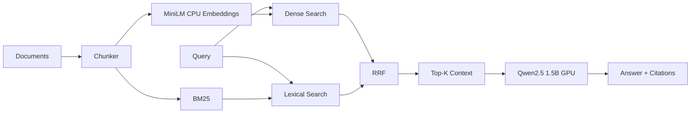

# LocalDoc-RAG — Architecture

## Problem and goals
Build private document QA using hybrid retrieval and local generation, optimized for constrained hardware but designed with a production migration path.

## Local requirements
Ingest TXT/Markdown, chunk with overlap, dense + BM25 retrieval, Reciprocal Rank Fusion, citation-aware generation, local API and no paid APIs.

## Non-functional requirements
Privacy, reproducibility, bounded memory use, low VRAM use, source traceability, modularity and measurable retrieval quality.

## Local constraints
Ryzen 7 4800-series, 16 GB RAM, GTX 1650 Ti 4 GB.

## Local architecture

## Component responsibilities
Chunker preserves source identity and overlap. Dense retrieval handles semantic similarity. BM25 handles identifiers and rare terms. RRF fuses rank positions without calibrating incompatible score distributions. Generator performs grounded response generation.

## Model rationale
`all-MiniLM-L6-v2` is small and CPU-friendly. `Qwen2.5-1.5B-Instruct` is selected to fit the 4 GB GPU target while retaining instruction-following quality.

## Alternatives rejected
Vector-only retrieval misses exact identifiers. BM25-only retrieval misses paraphrases. A 7B generator creates excessive VRAM pressure. A cross-encoder reranker is optional rather than default because of local latency.

## CPU/RAM/VRAM decisions
Embeddings stay on CPU; generator uses GPU. Avoid multiple model-loaded workers. Context and output lengths are bounded.

## Storage
Local prototype uses in-memory embeddings and BM25. Larger local corpora should persist FAISS/NumPy indexes.

## API
`GET /health` and `POST /query`.

## Reliability and failure handling
Add query-size limits, model-load error handling, generation timeout, weak-evidence abstention and startup corpus validation.

## Security/privacy
Local-only default, authenticated production APIs, document ACL filtering, prompt-injection scanning of retrieved content and no raw document logging.

## Observability
Track retrieval/generation latency, top-k overlap, fusion scores, citation coverage, abstention rate, tokens, RAM and VRAM.

## Evaluation
Retrieval: Recall@K, MRR, nDCG. Generation: groundedness, citation coverage, answer relevance and abstention correctness. System: p50/p95 latency and throughput.

## Testing
Chunking, source preservation, fusion ordering, empty corpora, long queries, citation formatting and retrieval regression sets.

## Bottlenecks
Startup embedding, in-memory index scale, single GPU generation queue and limited context.

# Production Scaling Architecture

## Service separation
Split ingestion, parsing, embedding, retrieval, reranking, generation and evaluation into independently scalable services.

## Stateless/stateful separation
Query APIs remain stateless. Metadata, source ACLs, indexes, object artifacts and job state move to durable services.

## Horizontal/vertical scaling
Horizontally scale query/retrieval APIs. Scale model serving based on active requests, queue depth, GPU utilization and tokens/sec. Vertically scale only where model memory or index locality requires it.

## GPU inference serving
Use vLLM, TGI or Triton for larger production models. Keep embedding/reranking pools separate when their hardware profiles differ.

## Batching/caching/quantization
Batch embeddings and inference. Cache immutable document embeddings and safe repeated retrieval. Quantize only after measured quality regression evaluation.

## Queues/asynchronous processing
Use asynchronous ingestion: upload -> queue -> parse -> chunk -> embed -> index -> publish. Choose NATS, RabbitMQ or Kafka based on durability, replay and throughput requirements.

## Databases/vector/object storage
PostgreSQL for metadata/ACLs; S3/MinIO for raw documents; pgvector for moderate scale or Qdrant/Weaviate/Milvus for specialized vector workloads; OpenSearch when lexical filtering/search complexity justifies it.

## Data ingestion and concurrency
Use idempotent stages and bounded worker pools. Bound generation concurrency to prevent GPU OOM.

## Load balancing/autoscaling
Route inference by available GPU capacity rather than CPU alone. Scale from queue depth, p95 latency, GPU utilization and tokens/sec. HPA/KEDA are reasonable Kubernetes options.

## High availability/fault tolerance
Replicated stateless APIs, durable object storage, replicated metadata, idempotent ingestion, dependency circuit breakers and versioned indexes.

## Distributed processing
Shard ingestion and indexing by corpus/tenant; distribute query workloads only when index size or QPS requires it.

## Model registry/versioning
Track chunking policy, embedding model, reranker, generator, prompt and index version. Use MLflow or an equivalent registry.

## CI/CD
Unit tests -> retrieval regression -> generation eval -> container build -> security scan -> canary -> telemetry validation -> promote/rollback.

## Monitoring/tracing/logging
Use OpenTelemetry. Trace query -> retrieval -> reranker -> generation. Redact document content in logs by default.

## Security/IAM/secrets
OIDC, workload identity, secrets manager, encryption, document-level ACL filtering, tenant-aware retrieval and prompt-injection defenses.

## Multi-tenancy
Choose shared indexes with strict filters, per-tenant collections or physical isolation based on compliance and blast radius.

## Cost/performance
Optimize model size first, then cache, batch, quantize and autoscale. Rerank only shortlists.

## Backup/disaster recovery
Back up raw documents, metadata, ACLs and manifests. Embeddings can often be regenerated, reducing backup volume. Define RPO/RTO and test restores.

## Rollout/rollback
Version models and indexes independently and keep the previous version available for fast rollback.

## Cloud/on-prem/hybrid
Preserve logical service boundaries so data residency and accelerator placement can change without a redesign.

# ADRs
- ADR-001: Hybrid retrieval is default because enterprise queries mix semantic and exact-match needs.
- ADR-002: CPU embeddings preserve local GPU memory.
- ADR-003: RRF avoids score calibration between BM25 and cosine similarity.
- ADR-004: 1.5B generator balances quality and VRAM.
- ADR-005: Production retrieval and generation scale independently.