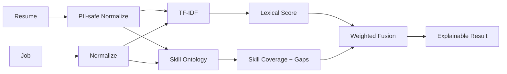

# SmartResume-NLP — Architecture

## Problem and goals
Build a private, explainable resume-to-role matching and skill-gap decision-support system. It must separate obvious PII from ranking features, normalize skills into an auditable ontology, provide transparent scoring, and avoid autonomous hiring decisions.

## Local architecture

## Local design rationale
The deterministic lexical+ontology baseline is the primary local mode because it is cheap, testable and interpretable. MiniLM semantic similarity is optional, not mandatory. This makes failure analysis and calibration easier than an LLM-only scorer.

## Trade-offs and ADRs
- ADR-001: Transparent lexical+skill scoring is the baseline.
- ADR-002: Obvious PII is removed before ranking feature generation.
- ADR-003: Dense semantic scoring is optional augmentation.
- ADR-004: Human review remains mandatory for employment decisions.
- ADR-005: Ontology/model/config lineage is first-class data.

## Hardware
The default path is CPU-only and fits Ryzen 7 + 16 GB RAM. Optional MiniLM also runs on CPU; GTX 1650 Ti is not required.

## Evaluation
Use labeled relevance pairs and skill annotations. Ranking: NDCG@K/MAP. Skill extraction: precision/recall/F1. Add calibration, job-family/seniority slices, formatting robustness and counterfactual tests where identity/contact information changes while qualifications remain constant.

## Reliability
Validate input sizes, version configs/ontology, use deterministic fallback when semantic models are unavailable, and preserve audit evidence for every score.

## Security/privacy
Encrypt raw resumes, minimize retention, apply RBAC, audit document access, exclude protected attributes from ranking, and provide human review/appeal paths.

## Observability
Track parser failures, unknown-skill rate, score distributions, ontology drift, p95 latency, config/model versions and fairness-oriented regression suites.

# Production Scaling Architecture

## State separation and services
Split ingestion/parsing, PII processing, skill extraction, embedding, retrieval/ranking, audit/evaluation and ontology/model administration. Keep APIs stateless; store documents, normalized profiles, embeddings, version lineage and audit history in durable services.

## Storage
PostgreSQL for entities/metadata/audits; S3/MinIO for encrypted documents; pgvector/Qdrant for embeddings; OpenSearch for lexical retrieval at large candidate volumes.

## Ingestion and queues
Use upload -> malware scan -> parse -> PII classify -> normalize -> skills -> embed -> index. Use NATS/RabbitMQ/Kafka according to replay and throughput requirements. Ensure idempotency and DLQs.

## Model serving and scaling
CPU pools are enough for MiniLM-scale encoders at moderate throughput. Larger rerankers get dedicated inference services. Horizontally scale stateless APIs; autoscale workers on queue depth, p95 and CPU/GPU utilization. Bound concurrency to prevent resource exhaustion.

## Batching/caching/quantization
Batch embeddings; cache immutable job/resume embeddings keyed by content checksum+model version. Quantize only after benchmark validation.

## HA/fault tolerance
Replicated APIs, durable queues, DB replication/backups, object-store versioning, circuit breakers, retries for idempotent stages and tested restore/deletion workflows.

## Observability
OpenTelemetry traces, service metrics, queue depth, retrieval/ranking quality, unknown-skill rate, score drift, slice metrics, latency and failure rates.

## Security/IAM/secrets
OIDC/SAML for users, workload identity for services, Vault/cloud secret manager, TLS, encryption at rest, tenant-aware authorization and immutable audit logs.

## Multi-tenancy
Tenant ID on every entity/index. Regulated tenants may use dedicated DBs, buckets, vector collections or isolated infrastructure.

## CI/CD and lineage
Version parser, normalization, ontology, ranking weights, embedding model, calibration and evaluation dataset. Pipeline: unit tests -> skill regressions -> PII/counterfactual tests -> ranking benchmark -> security scan -> canary -> monitor -> promote/rollback.

## Cost/performance
Use lexical+ontology retrieval as the cheap first stage. Apply dense embeddings/rerankers only when measured gains justify cost. Precompute and cache immutable representations.

## Backup/DR
Back up metadata/audit logs and encrypted canonical documents according to retention policy. Rebuild indexes from canonical records. Test RPO/RTO and erasure workflows.

## Rollout/rollback
Shadow-test new ranking logic, compare offline/online quality, canary by tenant/job family, and retain previous model/config/index versions for rollback.

## Cloud/on-prem/hybrid
On-prem for strict privacy, cloud for elasticity, hybrid where raw resumes remain on-prem and only approved normalized features/embeddings move across boundaries.
