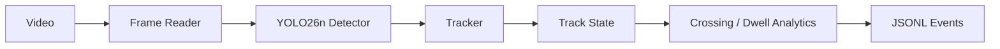

# VisionTrack-AI — Architecture

## Goal
Turn video streams into persistent object trajectories and auditable events while remaining feasible on a GTX 1650 Ti 4 GB.

## Local architecture

## Design rationale
Detection, identity tracking, and business-event logic are separate boundaries. The detector can later move to ONNX/TensorRT/OpenVINO without rewriting tracker analytics. The repository uses a deterministic IoU tracker for tests and an optional Ultralytics detector for real video. In production, ByteTrack/BoT-SORT/OC-SORT can replace the tracker behind the same interface.

## Local hardware decisions
Use a nano detector, short inference resolution, one GPU-loaded detector process, CPU-side tracking/event logic, bounded trajectory history, and no model weights in source control. Offline processing is the default because it makes backpressure explicit and reproducible.

## Evaluation
Detection: mAP, precision, recall. Tracking: HOTA, IDF1, MOTA, identity switches. Analytics: crossing/count precision and recall. Systems: FPS, p95 latency, dropped frames, RAM/VRAM.

## Reliability
Handle corrupt frames, camera reconnects, detector failures, empty frames, tracker reset semantics, bounded queues, event sink retries, and idempotent event IDs.

## Security/privacy
Prefer storing derived events over raw video. Encrypt retained clips, use tenant/camera ACLs, redact sensitive regions where needed, and define retention/deletion policies.

## Observability
Measure frame ingest rate, detector latency, tracker active IDs, event rates, dropped frames, queue depth, GPU memory, and sampled ID-switch/counting quality.

# Production Scaling Architecture

## State separation
Detector inference is stateless and batchable across streams. Tracker state is stateful and must be partition-affine to camera identity. Event sinks are append-only/idempotent.

## Scaling
Scale stream gateways and tracker workers by camera count. Scale GPU inference services by queue depth, p95 latency, utilization, and FPS. Vertical scaling permits larger batches/models; horizontal scaling improves capacity and fault isolation.

## GPU serving
Benchmark PyTorch first, then export validated models to ONNX/TensorRT/OpenVINO. Triton is suitable for centralized dynamic batching. Edge inference is preferred when video egress/privacy dominates centralized efficiency.

## Queues/backpressure
Use bounded queues and explicit frame sampling/drop policies rather than unlimited latency growth. Kafka/NATS/Redpanda are suitable depending replay and durability requirements.

## Storage
PostgreSQL for camera/config/model lineage; object storage for approved clips/snapshots; columnar/time-series storage for events; event bus for downstream consumers.

## Concurrency/load balancing
Consistent-hash streams to tracker partitions. Load-balance detector calls independently. Do not split one camera's tracking state across workers without reconciliation.

## HA/fault tolerance
Replicate stateless services, checkpoint offsets/configuration, make events idempotent, use dead-letter queues, and define explicit behavior when tracker state is lost after failover.

## Model/version management
Record detector checksum, input resolution, confidence thresholds, tracker config, event rules, and evaluation dataset version for every deployment.

## CI/CD
Unit tests → synthetic track regressions → labeled video benchmark → FPS/VRAM benchmark → security scan → shadow cameras → canary → promote/rollback.

## IAM/multi-tenancy
OIDC/workload identity, per-tenant camera ACLs, encrypted topics/buckets, secret manager, and tenant-scoped retention.

## Cost/performance
Tune frame rate, resolution, detector tier, and quantization before adding GPUs. Keep high-volume video close to the edge when bandwidth is costly.

## Backup/DR
Back up configuration, model lineage, and derived events. Raw-video backup depends retention policy; source clips should be reproducible where legally retained.

## Rollout/rollback
Shadow new detector/tracker combinations, compare event metrics, canary by site/camera class, and keep the prior model/config bundle deployable.

## Cloud/on-prem/hybrid
On-prem/edge reduces privacy and bandwidth risk; cloud offers elastic accelerators; hybrid commonly performs detection/tracking near cameras and sends metadata centrally.

## ADRs
- Separate detector, tracker, and analytics boundaries.
- Keep local tracking/event logic CPU-side.
- Use deterministic core tests independent of model downloads.
- Prefer derived events over raw video retention.
- Partition production tracker state by camera ID.
