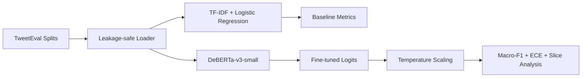

# TransformerSentiment-Lab — Architecture

## Goal
Build a reproducible sentiment benchmark that measures classification quality, confidence calibration, and failure slices rather than treating aggregate accuracy as sufficient.

## Local architecture

## Data protocol
Retain the supplied train/validation/test split. Validation tunes model and calibration parameters; test stays untouched until final evaluation. Do not concatenate and randomly resplit benchmark data.

## Model rationale
For a stable labeled taxonomy, encoder-only classifiers provide materially better throughput and lower cost than generative LLM classification. DeBERTa-v3-small remains strong while being feasible on 4 GB VRAM with short sequences, batch size 4, gradient accumulation, checkpointing, and FP16.

## Baseline and trade-off
TF-IDF + logistic regression is mandatory. The transformer must beat the inexpensive baseline enough to justify added lifecycle complexity. Generative classifiers are rejected by default because their flexibility is unnecessary for a fixed three-class task and their latency/cost is substantially higher.

## Calibration
Temperature scaling is a first-class artifact fit on validation logits. Track NLL and expected calibration error; version the temperature with model/tokenizer/preprocessing versions.

## Slice/error analysis
Measure short/long text, URL, emoji-like content, and negation. Production slices should add language, product/domain, acquisition source, geography where legally appropriate, and time.

## Local hardware decisions
Max length 128; train batch 4; gradient accumulation 4; gradient checkpointing; FP16 when CUDA is available; capped training subset for quick experiments; CPU sparse baseline; no paid APIs.

## Reliability
Validate dataset schema and label map, handle download/cache failures, provide OOM mitigation by reducing batch/max length, guard prediction/calibration version mismatch, and reject malformed probability payloads.

## Security/privacy
Public benchmark data is used here. Production text may contain PII; apply minimization, retention, access controls, deletion, and audit logging.

## Evaluation
Primary macro-F1; secondary per-class precision/recall/F1, confusion matrix, NLL, ECE, slice metrics, p50/p95 latency, throughput, RAM/VRAM, and drift/OOD indicators.

# Production Scaling Architecture

## Service separation
Split ingestion, normalization/tokenization, inference, calibration/post-processing, analytics, evaluation/drift, and registry. Online inference remains stateless; training data, labels, models, calibration, and metrics are stateful/versioned.

## Scaling and GPU serving
Scale inference replicas horizontally. Benchmark CPU serving first; export validated encoders to ONNX/TensorRT/OpenVINO or Triton for dynamic batching. Use GPUs only when throughput/latency economics justify them.

## Batching/caching/quantization
Bucket by sequence length, dynamically batch, evaluate INT8 quantization, and cache immutable repeated content only where privacy rules permit.

## Queues
Use Kafka/Redpanda/PubSub-like durable streams for high-volume asynchronous scoring. Bound online queues and define timeouts/fallback behavior.

## Storage
PostgreSQL/warehouse for metadata and labels; object storage for dataset/model artifacts; analytics store for aggregated sentiment; model registry for deployable bundles.

## Concurrency/load balancing/autoscaling
Route by model version; protect accelerators with bounded queues; autoscale on QPS, queue depth, p95 latency, CPU/GPU utilization, and batch-fill efficiency.

## HA/fault tolerance
Replicate inference endpoints, make async jobs idempotent, use durable queues, preserve prior deployable model bundles, and separate model-service failure from downstream analytics.

## Distributed processing
Historical corpora can be partitioned across Ray/Dask/Spark or simple workers. Deterministic document IDs prevent duplicate scoring.

## Model/version lineage
Version dataset snapshot, tokenizer, base model, fine-tuned weights, label map, preprocessing, calibration temperature, evaluation suite, and code commit.

## CI/CD
Unit tests → dataset schema checks → baseline benchmark → transformer quality threshold → calibration/slice regressions → latency/memory benchmark → security scan → shadow/canary → promote/rollback.

## Observability
Trace request/model version; monitor latency/errors, class/confidence distribution, calibration proxies, text length, OOD/drift features, slice quality, and sampled human-reviewed labels.

## IAM/secrets/multi-tenancy
OIDC/workload identity, secret manager, tenant-scoped data/metrics, encrypted storage/transit, deletion policy, and audit trails.

## Cost/performance
Prefer a quantized encoder for stable high-volume taxonomy. Escalate to generative classification only if dynamic labels/reasoning deliver measurable business value.

## Backup/DR
Back up labeled datasets, model/calibration bundles, lineage, and evaluation reports. Raw production text follows retention policy.

## Rollout/rollback
Shadow new models, compare aggregate + slice + calibration metrics, canary by traffic/tenant, and retain the prior model+temperature bundle for immediate rollback.

## Cloud/on-prem/hybrid
On-prem suits sensitive text; cloud provides elastic training/batch capacity; hybrid can train centrally on approved data and deploy quantized encoders near data sources.

## ADRs
- Keep a sparse linear baseline.
- Use an encoder classifier for stable sentiment taxonomy.
- Treat calibration as a versioned model artifact.
- Preserve benchmark splits.
- Gate promotion on slice/calibration regression, not F1 alone.
