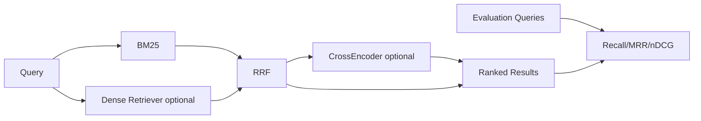

# SemanticSearch-Engine — Architecture

## 1. Problem and goals
Enterprise search must answer semantic queries and exact lexical queries such as part numbers, error codes, names and domain terminology. Goals: dependency-light local baseline; hybrid dense+sparse retrieval; RRF fusion; optional pairwise reranking; metadata filtering; measurable retrieval quality; production-ready migration path.

## 2. Local architecture

## 3. Why hybrid retrieval
Dense retrieval captures semantic similarity. BM25 handles exact tokens and identifiers. Their raw scores are not naturally calibrated, so RRF merges rankings using rank positions rather than score magnitudes. Current Qdrant guidance similarly presents dense+sparse candidate retrieval followed by RRF or late-interaction reranking.

## 4. Reranking
A CrossEncoder processes the query and document jointly, making it more accurate for pairwise relevance scoring but too expensive over the full corpus. It is a second-stage reranker over a bounded shortlist.

## 5. Local hardware decisions
BM25 is CPU-only; MiniLM-class dense encoder is optional and CPU-friendly; a small CrossEncoder only reranks top candidates; corpus is in-memory locally; no paid API or always-on database; model downloads are optional.

## 6. Evaluation
Compare sparse only, dense only, RRF hybrid, and hybrid+reranker with Recall@K, MRR, nDCG@K, p50/p95 latency, index size and memory. Do not assume hybrid is always superior; gate extra cost on held-out relevance gains.

## 7. Failure modes
Candidate cutoff, dense model mismatch, tokenizer mismatch, stale indexes, incorrect tenant filters, reranker latency and query drift.

## 8. Security/privacy
Apply ACL/tenant filtering before results leave retrieval. Encrypt sensitive indexes and audit document-access paths.

# Production Scaling Architecture

## 9. Service separation
Split ingestion/parser, embedding, lexical indexing, vector indexing, query retrieval, reranking, relevance evaluation and admin/model/index registry.

## 10. Storage choices
Moderate scale: PostgreSQL+pgvector and object storage. Specialized search: Qdrant/Milvus/Weaviate for vectors and OpenSearch/Elasticsearch for lexical search and filters. Qdrant can host dense and sparse vectors together.

## 11. Async ingestion
`upload -> queue -> parse -> chunk -> metadata/ACL -> dense embed -> sparse index -> publish index version`. Use idempotent document/version keys and atomic index publication.

## 12. Horizontal scaling
Stateless query APIs scale horizontally. Search stores shard/replicate independently. Rerankers scale by shortlist QPS and accelerator utilization.

## 13. GPU/model serving
Dense encoders/rerankers can use CPU at moderate throughput; higher QPS can use ONNX/TensorRT/Triton. Keep embedding and reranking pools separate.

## 14. Batching/caching/quantization
Batch document embeddings and latency-safe query embeddings; cache immutable embeddings and tenant-aware queries; quantize only after relevance regression tests.

## 15. Queues/backpressure
Ingestion is async; queue depth drives autoscaling. Query paths remain synchronous with bounded reranking latency.

## 16. Concurrency/load balancing
Load-balance stateless query services, route vector traffic by shard health and bound CrossEncoder concurrency.

## 17. Autoscaling
Signals: QPS, p95 retrieval latency, reranker queue depth, CPU/GPU utilization, ingestion depth and shard saturation.

## 18. HA/fault tolerance
Replicated APIs/stores, durable queues, idempotent indexing, DLQs, versioned index aliases and reranker circuit breakers. Degrade to fused retrieval when reranking fails.

## 19. Multi-tenancy
Shared indexes with mandatory filters, per-tenant collections or physical isolation. Every cache key preserves tenant scope.

## 20. Observability
Recall/nDCG regression, dense-vs-sparse overlap, zero-result rate, reranker lift, stage latency, index freshness, filter selectivity, drift and memory/index size. Use OpenTelemetry.

## 21. Model/index lineage
Version chunking, tokenizer, dense model, sparse config, RRF, reranker, corpus snapshot, relevance dataset and index build ID.

## 22. CI/CD
Unit tests -> retrieval benchmark -> latency benchmark -> index compatibility -> security scan -> shadow -> canary -> held-out relevance verification -> promote/rollback.

## 23. Cost/performance
Start sparse-only and measure. Add dense only when relevance gain justifies storage/query cost; rerank only a small shortlist.

## 24. Backup/DR
Back up canonical documents, metadata/ACLs, judgments and manifests. Regenerate embeddings/indexes when possible.

## 25. Rollout/rollback
Use versioned indexes/aliases, shadow new bundles, compare relevance+latency, shift traffic gradually and retain previous bundle.

## 26. Cloud/on-prem/hybrid
On-prem for sensitive documents; cloud for elastic indexing/inference; hybrid can keep canonical documents on-prem while operating approved derived indexes centrally.

# ADRs
- ADR-001: BM25 remains first-class.
- ADR-002: RRF is default fusion because score scales differ.
- ADR-003: CrossEncoder is second-stage only.
- ADR-004: Relevance gains must justify hybrid cost.
- ADR-005: ACL filtering is enforced in retrieval.
