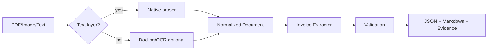

# OCRDoc-Intelligence — Architecture

## 1. Problem
Business documents mix native PDF text, scans, tables, forms, headers, stamps, formulas and images. Plain OCR loses structure and provenance. The system converts documents into a normalized representation, extracts structured business fields, validates them and preserves evidence for review.

## 2. Local architecture

## 3. Current document-AI direction
Modern systems are layout-aware rather than OCR-only. Docling provides a unified representation for text, tables, pictures, hierarchy, layout boxes and provenance. PaddleOCR-VL-1.5 represents the compact VLM direction for multilingual document parsing and is an advanced production/research option rather than the local default on 4 GB VRAM.

## 4. Local hardware strategy
Use native PDF text before OCR; CPU-side field extraction/validation; OCR only pages that need it; avoid loading a VLM for text-native documents; sequential/bounded page processing; optional Docling CPU/CUDA path; deterministic text backend for tests.

## 5. Data model
`ParsedDocument` contains source, text blocks, page, block type, optional bounding box and metadata. Production persists richer item-level layout/provenance.

## 6. Extraction strategy
Explainable regex/table rules form the local baseline. Production expands to template families, classifier/router, table model, field model/VLM, confidence calibration and human review.

## 7. Validation
Never trust OCR/model output without consistency checks: invoice number, total, quantity×unit price≈amount, line-items≈subtotal, subtotal+tax≈total and retained evidence/confidence.

## 8. Evaluation
Parsing: CER/WER, layout F1, table structure metrics. Extraction: field precision/recall/F1, exact match, line-item accuracy, document acceptance accuracy. System: pages/sec, p50/p95 latency, OCR fallback, review rate and RAM/VRAM.

## 9. Security/privacy
Use encryption, short retention, document-level ACLs, malware scanning, audit logs and deletion policies. Avoid external OCR APIs by default.

# Production Scaling Architecture

## 10. Service separation
Upload gateway, malware validation, document router, native parser pool, OCR/layout pool, VLM parser pool, extraction, validation, human-review queue, result API and evaluation/model registry.

## 11. Routing
Route by file type, native-text quality, page count, language, table/form density, document type and cheap-parser confidence. Use the cheapest adequate path first and escalate only when quality requires it.

## 12. Queues/async processing
`upload -> queue -> classify -> parse/OCR -> extract -> validate -> review-if-needed -> publish`. Use idempotent document/version keys. Large documents support page-level fan-out plus deterministic merge.

## 13. GPU/model serving
Dedicated GPU pools serve layout/VLM models. Batch compatible pages when latency allows and evaluate quantization/optimized runtimes for compact document VLMs.

## 14. CPU/GPU split
CPU handles native extraction, preprocessing, rule extraction, validation and cheap OCR. GPU handles layout detectors, table models, VLM parsing and complex visual extraction.

## 15. Storage
Object storage for originals/page images; PostgreSQL for metadata/jobs/extractions/review state; warehouse for analytics/evaluation; optional vector store for retrieval; artifact registry for parser/OCR/VLM versions.

## 16. Concurrency/backpressure
Bound page rendering/OCR concurrency, use tenant quotas/priorities and prevent huge PDFs from starving interactive jobs.

## 17. Autoscaling
Signals: queued pages, pages/sec, p95 latency, GPU utilization, OCR/VLM depth and review backlog.

## 18. HA/fault tolerance
Replicated APIs, durable queues, idempotent stages, page retries, DLQ, resumable large docs, deterministic merge and parser fallback.

## 19. Multi-tenancy
Tenant IDs flow through objects/queues/results. Regulated tenants may require dedicated buckets, keys, worker pools or isolated deployments.

## 20. Model/version lineage
Record parser backend/version, OCR, layout/table model, VLM, extraction rules/model, normalization, validation, prompt/schema and evaluation version. Every field should be reproducible.

## 21. Observability
Conversion failures, fallback rate, pages/sec, confidence distributions, validation failures, labeled field accuracy, review rate, model usage, GPU/CPU/RAM and latency by type/page count. Use end-to-end trace IDs.

## 22. CI/CD
Unit tests -> parser fixtures -> OCR/layout benchmark -> extraction benchmark -> validation regressions -> latency/memory -> security scan -> shadow -> canary -> promote/rollback.

## 23. Human-in-the-loop
Low-confidence/inconsistent documents enter review. Corrections can become labeled data subject to privacy policy. Do not auto-accept uncertain financial/medical fields.

## 24. Cost/performance
Native extraction is cheapest; OCR only scanned pages; escalate to VLM only when layout/table complexity justifies it. Routing policy is the main cost lever.

## 25. Backup/DR
Back up originals per retention policy, extraction metadata, review decisions, lineage and evaluation datasets. Regenerate derived page images when possible.

## 26. Rollout/rollback
Shadow new parsers/models, compare metrics, canary by document type/tenant and retain previous routing/model bundle.

## 27. Cloud/on-prem/hybrid
On-prem suits sensitive documents; cloud simplifies elastic OCR/VLM acceleration; hybrid can keep originals on-prem while centralizing approved structured outputs/metrics.

# ADRs
- ADR-001: Native text before OCR.
- ADR-002: Backend-neutral normalized document schema.
- ADR-003: Validation is mandatory before acceptance.
- ADR-004: VLM parsing is an escalation tier, not default.
- ADR-005: Human review is part of production architecture.
