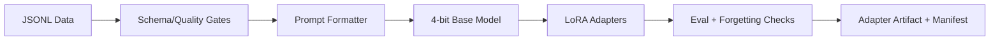

# LoRA-FineTune-Lab — Architecture

## Problem and goals
Adapt a small instruction model to a narrow domain without full-parameter training, while preserving reproducibility, evaluation discipline and a path to production adapter serving.

## Local architecture

## Why QLoRA
QLoRA freezes a quantized base model and trains low-rank adapters, reducing memory versus full fine-tuning. Current TRL/PEFT documentation continues to support 4-bit QLoRA workflows, and recent 2026 work shows rank is a real quality/retention trade-off rather than a cosmetic hyperparameter.

## Local constraints and model choice
The GTX 1650 Ti has 4 GB VRAM, so the default is a 0.5B instruction model. Even QLoRA does not make arbitrary 7B+ models practical on this GPU once activations, optimizer state and framework overhead are included.

Local controls:
- batch size 1;
- gradient accumulation 16;
- sequence length 512;
- FP16 compute;
- NF4 + double quantization;
- gradient checkpointing can be added if needed;
- adapter-only checkpoints.

## Dataset engineering
Validate schema, empties, duplicates, label/format consistency and train/eval separation. Production datasets also need provenance, license, PII review, decontamination and example-level lineage.

## Evaluation
Use task-native metrics rather than training loss alone:
- exact/structured match;
- tool-plan validity;
- JSON schema validity;
- task success;
- held-out general capability checks for forgetting;
- latency and memory before/after adapter.

## ADRs
- ADR-001: PEFT over full fine-tuning on constrained hardware.
- ADR-002: 0.5B default because VRAM feasibility is a hard requirement.
- ADR-003: adapter rank is tuned against both specialization quality and retention.
- ADR-004: adapter promotion requires held-out task and general-capability checks.

# Production Scaling Architecture

## Service separation
Separate dataset curation, training jobs, evaluation, registry, adapter serving and telemetry. Training is asynchronous; serving is stateless except model/adapter caches.

## Training infrastructure
Use queued GPU jobs with resource requests, dataset snapshot IDs, immutable configs and preemption-safe checkpoints. Larger models move to 16–80 GB accelerators or distributed training; local configs remain logically compatible.

## Multi-adapter serving
Serve one base model with multiple LoRA adapters when framework support and isolation requirements allow. Cache hot adapters, evict cold adapters, and route requests by tenant/task/version. Dedicated replicas remain preferable for strict isolation or incompatible adapters.

## GPU serving
Use vLLM/TGI/Triton-class serving where adapter support, throughput and model architecture are validated. Track KV-cache pressure separately from adapter memory.

## Batching/caching/quantization
Batch requests with the same compatible model/adapter where possible. Quantize base models after quality evaluation. Cache deterministic preprocessing and safe repeated outputs using model+adapter+prompt version keys.

## Registry/versioning
Registry records base model checksum, adapter weights, PEFT config, tokenizer, dataset snapshot, training code commit, metrics, safety results and hardware/runtime.

## CI/CD
Schema tests -> tiny smoke training -> held-out task eval -> forgetting/safety regression -> inference benchmark -> artifact scan -> registry candidate -> shadow/canary -> promote/rollback.

## Observability
Monitor adapter load latency, cache hit ratio, task success, schema-valid output rate, p50/p95 latency, tokens/sec, GPU memory, OOMs and per-adapter drift.

## Security/IAM
Restrict training data and adapter artifacts by tenant/project. Scan datasets for secrets/PII, sign artifacts, use workload identity and secrets managers, and audit adapter promotion.

## Multi-tenancy
Options: shared base + adapters, tenant-dedicated replicas, or isolated clusters. Selection depends on data sensitivity, adapter interference risk and SLOs.

## HA/fault tolerance
Replicated serving, immutable adapter artifacts, fallback to previous adapter/base model, idempotent training jobs and durable experiment metadata.

## Cost/performance
Choose the smallest base that meets quality. PEFT lowers training cost, but serving a large base for tiny adapters can dominate total cost; measure lifecycle economics, not only fine-tuning cost.

## Backup/DR
Back up adapter weights, manifests, datasets where policy allows and evaluation artifacts. Base models can often be reacquired from pinned upstream revisions.

## Rollout/rollback
Shadow new adapters, canary by tenant/task, compare outcome metrics and instantly route back to the prior adapter version.

## Cloud/on-prem/hybrid
On-prem fits sensitive datasets; cloud fits bursty training; hybrid can keep data/preprocessing local while running approved de-identified training jobs centrally.
