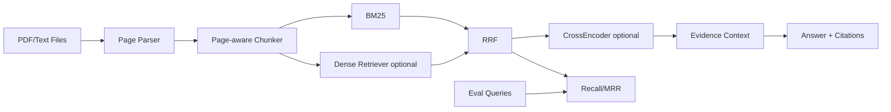

# MultiPDF-RAG — Architecture

## Problem
Answer questions across multiple documents while preserving page-level evidence, supporting exact identifiers and semantic paraphrases, and measuring retrieval quality independently of generation quality.

## Local architecture

## 2026 design direction
Recent RAG work continues to emphasize hybrid retrieval, reranking and explicit grounding evaluation. Multi-hop evaluation datasets also show hybrid retrieval outperforming single retrieval modes on noisy document pools, while leaving bridge-style queries challenging.

## Local design choices
- page provenance is immutable metadata;
- BM25 is always available for codes/names/exact phrases;
- dense retrieval is optional on CPU;
- RRF avoids score calibration;
- reranking is optional and shortlist-only;
- retrieval is evaluated before adding an LLM generator;
- evidence answer fallback keeps the smoke path fully local.

## Chunking
Chunk within page boundaries to keep citations interpretable. Production can use heading-aware or semantic chunking, but chunk policy must be versioned and benchmarked because it directly changes recall.

## Evaluation
Retrieval: Recall@K, MRR, nDCG, multi-hop coverage, zero-result rate.
Generation: claim support, citation precision/recall, abstention correctness, answer relevance.
System: p50/p95 latency, ingest throughput, index freshness and memory.

## Security
Document ACLs must be enforced before or during retrieval, not only after generation. Retrieved context is untrusted input and should be isolated from system/tool instructions to reduce prompt-injection risk.

## ADRs
- ADR-001: Page-level provenance is mandatory.
- ADR-002: Hybrid retrieval is the production target; BM25-only is the local baseline.
- ADR-003: Retrieval quality is evaluated separately from generation.
- ADR-004: Rerank only a bounded candidate shortlist.
- ADR-005: Insufficient evidence triggers abstention.

# Production Scaling Architecture

## Service separation
Separate upload, malware scan, parsing/OCR, chunking, embedding, lexical/vector indexing, query retrieval, reranking, generation, grounding evaluation and audit services.

## Stateful/stateless
Query APIs, rerankers and generators are horizontally scalable stateless services. Canonical documents, metadata/ACLs, indexes, model artifacts and job state are durable/stateful.

## Ingestion
`upload -> durable queue -> parse/OCR -> chunk -> ACL metadata -> embeddings -> lexical/vector index -> atomic publish`.
Use content hashes and idempotent document-version IDs.

## Storage
- object storage: original PDFs and parsed artifacts;
- PostgreSQL: document metadata, ACLs, job/index lineage;
- OpenSearch: lexical retrieval at scale;
- pgvector/Qdrant/Milvus/Weaviate: dense retrieval depending scale/ops requirements.

## Reranking/model serving
Use dedicated reranker pools and vLLM/TGI/Triton-class generator serving where appropriate. Bound reranking candidate count and generation concurrency. Small embedding/reranking models can often stay CPU-based.

## Batching/caching/quantization
Batch document embeddings and safe query embeddings; cache immutable chunk embeddings; use tenant-aware retrieval caches; quantize serving models only after quality regression tests.

## Queues/backpressure
Parsing/OCR/indexing is asynchronous. Queue depth drives workers. Query path uses strict stage timeouts and can degrade from reranked hybrid -> hybrid -> lexical instead of total failure.

## Autoscaling
Signals: ingest queue depth, retrieval QPS, p95 latency, vector-store saturation, reranker queue, tokens/sec, GPU memory and generator queue depth.

## HA/fault tolerance
Replicated APIs, durable queues, replicated metadata/search stores, idempotent ingest, dead-letter queues, versioned indexes and fallback retrieval tiers.

## Multi-tenancy
Shared index + mandatory tenant filters, per-tenant collections, or physical isolation. All caches and traces carry tenant scope.

## Observability
Trace query across lexical, vector, fusion, reranking and generation. Monitor retrieval lift, citation coverage, abstention rate, prompt-injection detections, index freshness and quality by document type/tenant.

## Model/index lineage
Version parser, OCR, chunking policy, embedding model, sparse config, fusion parameters, reranker, generator, prompt, corpus snapshot and evaluation set.

## CI/CD
Unit tests -> ingestion fixtures -> retrieval benchmark -> grounding/citation eval -> adversarial prompt-injection suite -> latency/load test -> image/security scan -> shadow/canary -> promote/rollback.

## Security/IAM
OIDC, workload identity, secrets manager, encryption, document-level ACLs, signed ingestion artifacts and explicit separation between retrieved content and privileged tool/system instructions.

## Cost/performance
Optimize retrieval quality before increasing generator size. Dense + reranking cost should be justified by held-out recall/nDCG gains. Cache embeddings and avoid regenerating unchanged indexes.

## Backup/DR
Back up documents, metadata, ACLs, lineage and evaluation judgments. Search indexes can be rebuilt from canonical data; test restore procedures.

## Rollout/rollback
Shadow new chunk/index/model versions, compare retrieval/grounding metrics, canary by tenant, retain previous index aliases and model versions for instant rollback.

## Cloud/on-prem/hybrid
On-prem suits sensitive PDFs; cloud suits elastic OCR/index/inference; hybrid can keep original documents local and synchronize approved derived indexes/metadata.
