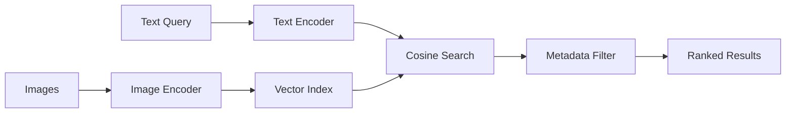

# VisionSearch-CLIP — Architecture

## Local design
A dual-encoder maps text and images into one normalized vector space, then cosine similarity retrieves nearest items.

The dependency-light test encoder is not a production semantic model. It exists so ranking, filtering, metrics and packaging remain deterministic without downloading weights. The optional production adapter uses a small SigLIP 2 checkpoint.

## Why modernize beyond original CLIP
CLIP established scalable contrastive image-text alignment. Newer SigLIP-family models improve the training objective and multilingual/fine-grained alignment. The architecture therefore treats the encoder as replaceable and versions embeddings with the exact model.

## Evaluation
Use text→image and image→image Recall@1/5/10, MRR, query slices, duplicate-aware relevance judgments and latency/memory. Test modality-gap behavior rather than assuming one shared index is equally calibrated across modalities.

## Local hardware
Prefer small/base encoders, batch size 1–8, FP16 only when safe, CPU fallback, precomputed corpus embeddings, and compact float32/float16 arrays.

## Production Scaling Architecture
- Stateless query API; stateful vector/index service.
- Batch offline image embeddings on GPU workers.
- Use Qdrant/pgvector/Milvus/FAISS depending scale and operational needs.
- Shard by tenant/catalog and replicate hot indexes.
- Dynamic batching for query encoders within latency SLOs.
- Quantize embeddings/models only after retrieval-regression tests.
- Cache immutable catalog embeddings keyed by content checksum + model version.
- Queue ingestion; use idempotent image IDs and index version aliases.
- Autoscale embedding workers on queue depth/GPU utilization; query replicas on QPS/p95.
- HA through replicated APIs/index replicas and rebuildable embeddings from canonical object storage.
- Store source images in object storage, metadata in PostgreSQL, vectors in specialized index.
- OpenTelemetry traces for encode/search/filter; metrics for Recall regression, zero-result rate, modality gap, latency and drift.
- IAM, signed object access, tenant filtering at retrieval time, encryption and audit logs.
- Version model, processor, embedding dimension, normalization, corpus snapshot and evaluation set.
- CI/CD gates on Recall/MRR, latency and compatibility before index alias promotion.
- Canary new encoders using shadow embeddings; rollback by switching alias to previous index.
- On-prem for sensitive media; cloud for elastic GPU embedding; hybrid for edge ingestion + central metadata search.

## ADRs
1. Encoder is replaceable and explicitly versioned.
2. Cosine similarity uses normalized embeddings.
3. Metadata/tenant filtering is part of retrieval, not post-processing.
4. Corpus embeddings are precomputed.
5. Retrieval quality must be measured per modality and slice.
