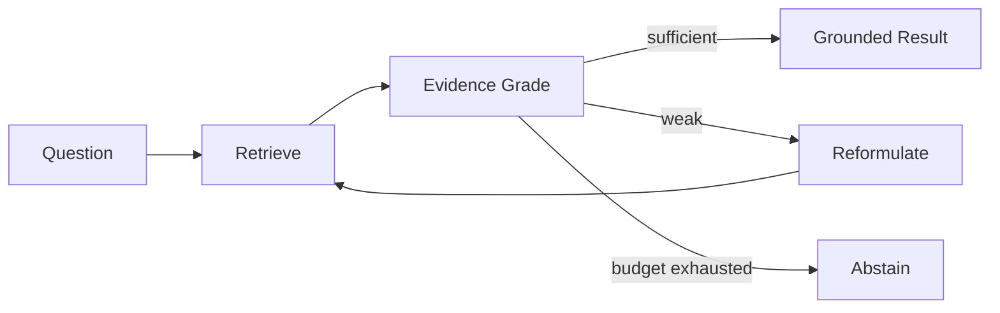

# AgenticRAG-Local — Architecture

## Problem
One-shot RAG cannot react when retrieval is poor. A production-safe agentic design should make retrieval adaptive without creating an unbounded loop.

## Local control loop

The loop has explicit maximum steps and stop reasons. The deterministic evidence grader is intentionally simple for offline verification; production can replace it with learned relevance/evidence models after benchmark validation.

## Reliability principles
- finite step/tool budgets;
- deterministic fallbacks;
- explicit abstention;
- citations/evidence returned with result;
- state trace for every decision;
- retrieval quality measured separately from generation;
- tool permissions scoped by policy.

## Evaluation
Measure answerable/unanswerable classification, retrieval Recall/MRR/nDCG, groundedness, citation precision, mean tool calls, p95 latency, cost/step, loop termination rate and reformulation lift over one-shot RAG.

## Local hardware
BM25 and control plane are CPU-only. Optional local LLM generation should use a small quantized model. Retrieval control remains functional if generation is unavailable.

# Production Scaling Architecture

## State separation
Stateless API accepts tasks. Durable orchestration state stores run ID, current step, query variants, evidence, tool outputs and terminal reason.

## Services
1. API/auth gateway
2. orchestrator/state machine
3. retrieval gateway
4. sparse/vector/graph tools
5. evidence grader/reranker
6. optional local/remote model router
7. policy/guardrail service
8. evaluation/trace store

## Queues and concurrency
Long-running agent runs use durable queues. Enforce per-run and per-tenant concurrency, time, token and tool-call budgets. Use idempotency keys for tool execution.

## Retrieval
Hybrid lexical+dense retrieval is the production default where benchmarks support it. Add graph or SQL tools only for queries that need them; route by query type instead of querying every store every time.

## Model serving
Run small graders/rerankers separately from generative models. GPU pools scale independently. Batch embedding/reranking where latency permits and quantize after regression tests.

## Caching
Cache immutable embeddings and safe retrieval outputs with tenant/index/model-version keys. Do not cache authorization-sensitive results across tenants.

## Data
PostgreSQL for run state/config/lineage; vector store for embeddings; lexical store for exact search; object storage for canonical documents; event/log store for traces.

## HA/fault tolerance
Durable run state, retries with idempotency, circuit breakers, dead-letter queues and tool-specific timeouts. If a secondary tool fails, degrade to a verified simpler retrieval path or abstain.

## Autoscaling
Scale on queued runs, retrieval latency, reranker queue, model GPU utilization and p95 end-to-end latency.

## Observability
OpenTelemetry span per agent step/tool call. Metrics: loop depth, reformulation rate, retrieval lift, abstention rate, tool errors, grounding score, tokens/latency/cost, policy blocks and runaway-loop prevention.

## Security
OIDC/workload identity, least-privilege tool credentials, secrets manager, document ACL enforcement inside retrieval, prompt-injection filtering on retrieved content, tool allowlists and immutable audit traces.

## Multi-tenancy
Tenant-scoped indexes/state/cache keys. Regulated tenants can receive dedicated storage and model pools.

## CI/CD and evaluation
Unit tests -> retrieval benchmark -> adversarial/prompt-injection suite -> agent termination tests -> grounding/citation benchmark -> latency/cost gates -> shadow -> canary -> promote.

## Versioning
Version orchestrator policy, prompts, retrievers, embedding model, reranker/grader, model route, knowledge index and evaluation corpus together with each trace.

## Rollout/rollback
Shadow new policies, compare one-shot vs corrective lift, canary by tenant/query family, cap new step budgets, and retain prior policy bundle for immediate rollback.

## Cost/performance
The agent should not iterate by default. Start with one-shot retrieval; invoke correction only on low evidence. This preserves latency and prevents agentic complexity from becoming unconditional overhead.

## Backup/DR
Back up state/config/audit/evaluation data. Rebuild search indexes from canonical documents. Test recovery of in-flight runs and safe cancellation.

## Cloud/on-prem/hybrid
On-prem is suitable for sensitive knowledge bases and local models. Cloud provides elastic retrieval/model pools. Hybrid often keeps documents/indexes near data while centralizing orchestration and telemetry.

## ADRs
1. Agent loops are bounded.
2. Weak evidence causes correction or abstention, never confident guessing.
3. Retrieval control is independent from answer generation.
4. Tool permissions are policy-scoped.
5. Added agent steps must show benchmarked retrieval/grounding lift.
