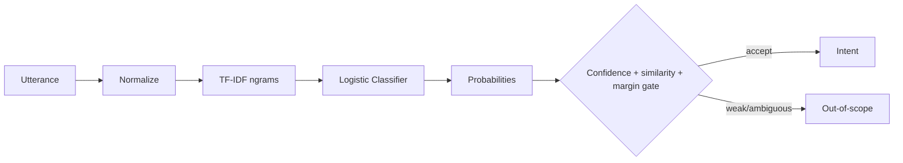

# NLPIntent-Engine — Architecture

## Local design

## Rationale
A sparse linear baseline is highly competitive for stable intent taxonomies, inexpensive to retrain and easy to inspect. The central production concern is not only closed-set accuracy but safe handling of unseen/ambiguous inputs.

## Evaluation
- macro-F1 and per-intent precision/recall;
- OOS precision/recall/F1;
- confidence calibration/ECE;
- paraphrase and typo robustness;
- class-frequency slices;
- latency and memory;
- confusion stability under new intents.

## Current 2026 direction
Recent open-weight evaluations show model size alone does not determine intent performance; robustness, calibration and deployment efficiency matter. Production designs should benchmark compact embedding/encoder models against simple classifiers rather than automatically deploying a generative LLM.

## Local hardware
Default CPU-only. Optional bge-small/SetFit-style encoder can run on CPU or GTX 1650 Ti with small batches.

# Production Scaling Architecture

## Services
1. normalization/gateway
2. intent inference
3. OOS/uncertainty gate
4. active-learning feedback
5. label/ontology registry
6. evaluation/drift service

## Model options
- TF-IDF/logistic for stable small taxonomies
- SetFit/embedding + linear head for few-shot semantics
- compact encoder fine-tuning for multilingual/domain-specific traffic
- generative model only where intent taxonomy is dynamic or reasoning materially improves benchmarked outcomes

## Data
PostgreSQL for intent definitions/model lineage; object storage for training snapshots; warehouse for labeled traffic and evaluation slices.

## Scaling
Stateless inference replicas scale horizontally. Encoders batch requests under p95 latency constraints. CPU fleets are often sufficient; GPU pools are optional.

## OOS handling
Use calibrated confidence, margin, density/distance signals and dedicated OOS examples. Route rejected inputs to safe fallback/human support rather than forcing an intent.

## Active learning
Sample low-confidence, high-disagreement and drifted utterances for annotation. Protect against feedback loops by keeping evaluation sets immutable.

## Reliability
Version preprocessing, label maps and thresholds with the model. Use deterministic fallback rules when inference/model loading fails.

## Observability
Track per-intent volume/F1, OOS rate, confidence distribution, ambiguity rate, label drift, unknown-token/embedding drift, p95 latency and feedback correction rate.

## Security
PII redaction before analytics, tenant-specific label spaces, encrypted logs, least-privilege access and retention limits.

## CI/CD
Unit tests -> benchmark -> OOS suite -> perturbation suite -> calibration gate -> latency test -> shadow traffic -> canary -> promote/rollback.

## ADRs
1. OOS rejection is first-class.
2. Sparse baseline must remain in benchmark suite.
3. Model upgrades require measurable robustness/calibration gains.
4. Intent labels and thresholds are versioned artifacts.
5. Active-learning traffic never replaces a frozen holdout.
