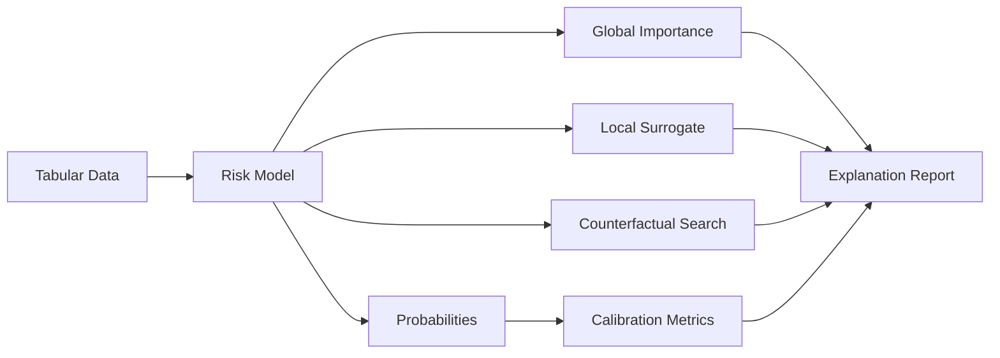

# ModelExplain-ML — Architecture

## Local design

## Explainability principles
An explanation is not automatically trustworthy because a library produced it. Production explanation systems should measure fidelity, stability, latency and policy compliance.

## Global explanations
Held-out permutation importance measures predictive dependence without trusting model-internal impurity importance. Partial dependence describes marginal response but must be interpreted cautiously under correlated features.

## Local explanations
The local surrogate perturbs the neighborhood of one case and fits a weighted Ridge model against the original model probabilities. This gives an interpretable approximation while making fidelity/stability measurable.

## Counterfactuals
Counterfactual search is constrained by an actionability policy: age is immutable; changes have realistic directions; output is advice for model understanding, not guaranteed real-world causal effect.

## Evaluation
Predictive: ROC-AUC, Brier, log loss, ECE.
Explanation: local surrogate fidelity, cosine/rank stability, explanation latency, attribution agreement, counterfactual feasibility and immutable-feature violation rate.

## Current 2026 direction
Recent tabular explanation research targets real-time high-fidelity attribution because traditional KernelSHAP can be too slow for interactive workflows. The production lesson is to treat explanation latency and fidelity as measurable SLOs.

# Production Scaling Architecture

## Services
1. model inference service
2. explanation service
3. counterfactual/policy service
4. model/explanation registry
5. audit/evaluation service

## Separation
Prediction latency and explanation latency have different SLOs. Synchronous endpoints may return compact explanations; expensive analyses run asynchronously.

## Model support
Tree models can use TreeSHAP or optimized native explainers. Neural/tabular FMs may use gradient, surrogate or specialized fast explainers after validation.

## Data
Store model version, feature schema, preprocessing version, explanation method/version, sampled background dataset ID and explanation result hash.

## Caching
Cache explanations only for immutable model+feature vectors and policy-safe tenants. Invalidate on model/preprocessing/background-set changes.

## Concurrency/autoscaling
Scale explanation workers separately from inference. Queue expensive batch explanation jobs. Autoscale on explanation queue depth and p95 latency.

## Counterfactual policy
Maintain feature mutability, legal constraints, monotonic direction, business bounds and cost functions in a versioned policy registry separate from model code.

## Observability
Monitor explanation failures, latency, attribution drift, stability/fidelity distributions, counterfactual feasibility and immutable-feature violations.

## Governance
For regulated decisions, explanation output must include model/version, data timestamp, feature transformations, uncertainty, limitations and whether the explanation is local/global.

## Security/privacy
Explanations can expose sensitive model/data information. Enforce authorization, redact sensitive features and apply retention/audit controls.

## CI/CD
Predictive benchmark -> calibration -> explanation fidelity/stability -> counterfactual policy tests -> latency -> security -> shadow -> canary -> promote.

## ADRs
1. Explanation quality is measured, not assumed.
2. Immutable/actionability constraints live outside the model.
3. Held-out permutation importance is the default global baseline.
4. Local surrogate explanations include stability checks.
5. Counterfactuals are model-behavior explanations, not causal guarantees.
