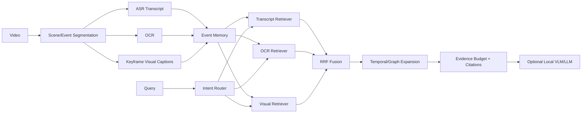

# VideoRAG-Local — Architecture

## 1. Problem

Long videos exceed practical multimodal context budgets. Sending every frame to a VLM is expensive, redundant and difficult to audit. The architecture therefore converts video into **structured event memory** and retrieves only evidence needed for a question.

## 2. Local architecture

## 3. Core data model

Each event stores stable event ID, start/end timestamps, transcript, OCR, visual description, temporal/semantic links, and extraction/model versions in production. This is preferable to indexing independent frames because it preserves local temporal coherence.

## 4. Research-informed decisions

2026 long-video RAG research increasingly emphasizes spatio-temporal structure instead of flat segments, retrieval evaluation separated from generation, multiple modalities/granularities, and event/causal relations for distant evidence. The local project implements the lightweight subset: event memory, modality-specific retrieval, intent weighting, fusion and temporal expansion.

## 5. Retrieval

Each modality has an independent lexical retriever so noisy OCR/ASR does not pollute the same score space. RRF combines ranked lists without calibrating incompatible raw scores. Query intent changes modality weights. A production upgrade can add CLIP/SigLIP visual embeddings, text embeddings, late-interaction retrieval or learned chunk reranking.

## 6. Temporal expansion

High-confidence seed events contribute linked neighbors. This is useful for questions such as "what happened after X?" where direct semantic matching may retrieve the trigger event but omit the consequence. Expansion is bounded to avoid flooding context with adjacent irrelevant material.

## 7. Evidence budget

The generator receives a compact evidence bundle with event IDs and timestamps. This enables citations and makes retrieval errors diagnosable independently of generation errors.

## 8. Local hardware strategy

For Ryzen 7 / 16 GB / GTX 1650 Ti 4 GB: scene detection, OCR and BM25 on CPU; ASR with tiny/base Whisper-class model; sparse keyframes; optional 3B-class VLM only on selected frames and preferably quantized; persist event memory after ingestion; never re-run video parsing per query. Qwen2.5-VL supports video inputs and dynamic FPS, but 3B+ VLM inference must be benchmarked carefully on a 4 GB GPU.

## 9. Evaluation

Retrieval: Recall@K, MRR/nDCG, evidence timestamp overlap, temporal-neighbor coverage, per-modality contribution, retrieval latency. Generation: answer correctness, citation precision/recall, groundedness, abstention correctness. System: ingest throughput, ASR real-time factor, GPU/RAM, query p95, storage per hour of video.

# Production Scaling

## 10. Ingestion services

Upload/stream gateway, media probe/transcode, scene/event segmenter, ASR workers, OCR workers, visual-caption/VLM workers, event merger and index publisher. Use a durable queue so expensive media processing is asynchronous and resumable.

## 11. CPU/GPU routing

CPU pools handle media metadata, scene detection, audio extraction, OCR where adequate and lexical indexing. GPU pools handle ASR at scale, visual encoders, VLM captioning, rerankers/generation. Route only selected keyframes/clips to expensive VLMs.

## 12. Storage

Object storage for original videos/thumbnails/audio; PostgreSQL for video/event metadata, lineage and ACLs; vector DB for multimodal embeddings; lexical index for transcript/OCR; graph store or relational edges for event links/causal structure.

## 13. Streaming and partitioning

Partition by `video_id`. Event construction for a video requires ordered timestamps, while downstream embedding tasks can parallelize by event. Use idempotent `(video_id,event_id,extractor_version)` keys.

## 14. Batching and backpressure

Batch ASR/visual embeddings where latency allows. Bound frame queues; drop redundant sampled frames rather than letting latency grow without limit. Large uploads use segment fan-out with deterministic merge.

## 15. Autoscaling

Signals: queued media minutes, ASR/VLM GPU utilization, event extraction latency, embedding queue depth and query QPS/p95.

## 16. HA/fault tolerance

Durable stage state, retryable segment jobs, dead-letter queue, resumable ingestion and index aliases. Query can degrade to transcript-only retrieval if visual services are unavailable.

## 17. Multi-tenancy/security

Tenant ACLs enforced during retrieval. Signed media URLs, encryption, retention/deletion policies and audit trails are mandatory because videos may contain faces, speech and sensitive visual information.

## 18. Observability

Trace video ingest to final event index. Monitor ASR/OCR confidence, event counts/hour, modality sparsity, retrieval hit rates, citation coverage, VLM fallback rate, GPU utilization and quality drift.

## 19. Model/index lineage

Version scene segmentation policy, ASR, OCR, visual encoder/VLM, event merge rules, embedding models, retrieval/fusion parameters, generator and evaluation corpus. Never mix embeddings from incompatible encoders in one index version.

## 20. CI/CD

Unit tests -> synthetic event benchmark -> labeled-video retrieval benchmark -> caption/ASR quality gate -> latency/VRAM gate -> security scan -> shadow indexing -> canary -> index alias promotion.

## 21. Cost/performance

The main optimization is **retrieval before expensive reasoning**. Precompute event memory once, use cheap retrieval for every query, and invoke VLM reasoning only on a small evidence set.

## 22. Rollout/rollback

Build new event/index versions side-by-side, shadow queries, compare retrieval and grounding metrics, then switch an alias. Preserve previous index and extractor versions for rollback.

## ADRs

- ADR-001: Event memory, not frame-by-frame context, is the primary representation.
- ADR-002: Modalities are retrieved independently before fusion.
- ADR-003: Temporal expansion is bounded and evidence-driven.
- ADR-004: Retrieval quality is evaluated independently of generation.
- ADR-005: Expensive VLM work happens at ingestion or after retrieval, not indiscriminately per query.
