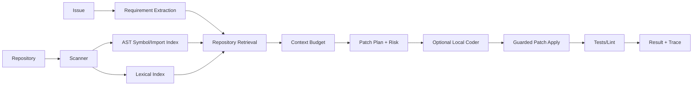

# CodePilot-Mini — Architecture

## 1. Problem

Repository-level coding is primarily a **context and change-management problem**, not just token generation. Before producing a patch, an assistant must identify the relevant code, recover implicit requirements, understand dependency impact, minimize edit scope and validate the result.

2026 research increasingly isolates repository exploration and requirement recovery as separate bottlenecks. CodePilot-Mini therefore makes those stages explicit.

## 2. Local architecture

## 3. Repository index

The scanner records path, file text, AST-defined functions/classes, imports and file size/type. The local retriever scores issue terms against code, symbols and paths. Production can augment this with code embeddings, RepoMap-like graph context, stack traces and learned retrieval agents.

## 4. Why retrieval is first-class

Recent Agent Retrieval Bench and SWE-Explore results show that upstream context acquisition deserves independent evaluation. CodeGrep further reports that higher-precision repository retrieval can reduce agent rounds and token usage. Therefore CodePilot reports retrieval Recall/MRR separately from patch success.

## 5. Requirement recovery

The local extractor creates explicit atomic requirements from an issue. Production should combine issue text with nearby tests, docs/API contracts, call sites, type constraints and git history when permitted. SWE-RPG highlights implicit requirement recovery as a major failure source, so planning artifacts should be inspectable before code generation.

## 6. Context budget

Only a ranked subset of files is supplied downstream. This limits prompt size and discourages irrelevant repository dumping. Production context selection should be evaluated by relevant-file/region coverage per token.

## 7. Change-risk model

Risk increases with number of production files, service/API boundary files, dependency fan-out and configuration/schema changes. The sample score is heuristic; production should learn or calibrate risk from repository history.

## 8. Patch safety

The local patch helper resolves paths inside a repository root, rejects traversal, requires expected source text, allows only allowlisted test commands and uses subprocess timeout. A real coding agent must operate in an isolated worktree/container, never directly on an engineer's working tree.

## 9. Local model strategy

The default project does not require a model. Optional patch generation can use a small Qwen coder-class model through Transformers/llama.cpp. On 4 GB VRAM, prefer quantized 0.5B–1.5B models and keep retrieval/context construction CPU-side.

## 10. Evaluation

Retrieval: file Recall@K, MRR, line/region coverage and relevant context per token. Planning: requirement coverage, correct file-set F1 and dependency-impact recall. Patch: tests passed, lint/type checks, diff size, regression rate and changed-file precision. System: rounds, tokens/context chars, wall time, model latency and sandbox failures.

# Production Scaling

## 11. Core services

Repository connector/snapshot service, indexer, retrieval/localization service, planning service, model router, isolated execution/sandbox service, test/evaluation service and trajectory/observability store.

## 12. Repository isolation

Every task receives an immutable base commit and an isolated Git worktree/container. Credentials and host filesystem are never exposed by default. Network is disabled unless a policy explicitly allows it.

## 13. Indexing

Build incremental indexes keyed by repository commit: lexical code index, symbol/import graph, optional code embeddings, test ↔ implementation links and call/reference graph. Cache unchanged files by blob SHA.

## 14. Retrieval strategy

Use staged retrieval: cheap lexical/path/symbol retrieval, graph expansion to callers/tests, optional embedding/learned reranker, selective abstention when repository evidence is weak. Do not spend a large model context on repository exploration if a small dedicated retriever can localize relevant files.

## 15. Model routing

Separate small retrieval/reranking model, planning model, coding model and optional reviewer/judge. Routing lets inexpensive models handle exploration and reserves stronger inference for difficult patches.

## 16. Sandboxed execution

Execution workers use ephemeral containers/VMs with CPU/RAM/time quotas, read-only base repository, writable worktree, dependency cache mounted read-only where safe, network denied by default, allowlisted commands and output-size limits.

## 17. Queues/backpressure

Long code tasks are asynchronous. Durable run state records step, retrieved context, generated patch, tests and terminal reason. Bound concurrent sandboxes per tenant.

## 18. Autoscaling

Signals: queued tasks, active sandboxes, model GPU utilization, retrieval latency, test wall time and p95 end-to-end duration.

## 19. HA/fault tolerance

Durable state machine, idempotent indexing, retryable model calls, sandbox recreation from base commit and explicit task cancellation. Preserve failed traces for diagnosis.

## 20. Storage

Git/object store for repository snapshots; PostgreSQL for run state, policy and model/index lineage; search/vector index for code context; object storage for logs/diffs/test artifacts; metrics store for evaluation history.

## 21. Security

Least-privilege Git tokens, no secret-file indexing, prompt-injection treatment for repository text, path traversal prevention, tool allowlists, command sandboxing and immutable audit logs. Repository files are untrusted input: comments/README instructions must never silently override system/tool policy.

## 22. Multi-tenancy

Tenant-specific repository ACLs, index namespaces, cache keys and sandbox credentials. Regulated customers may require isolated storage/model pools.

## 23. Observability

Trace every retrieval, file read, model call, patch and test. Track relevant-file recall, context tokens, rounds, test pass rate, patch size, tool errors, sandbox denials and cost/latency per resolved task.

## 24. CI/CD

Unit tests -> sample-repo retrieval benchmark -> patch/sandbox regressions -> security tests -> held-out repo benchmark -> shadow tasks -> canary users -> promote.

## 25. Rollout/rollback

Version retriever, prompts/policies, model, context budget and sandbox image together. Shadow new retrievers to measure localization lift before changing coding behavior.

## 26. Cost/performance

Context retrieval is a cost-control mechanism. Better localization reduces downstream model tokens, tool rounds and unnecessary file reads. Track **cost/time per solved task**, not only raw model latency.

## ADRs

- ADR-001: Repository retrieval is evaluated independently of patch generation.
- ADR-002: Every coding task runs from an immutable commit in an isolated worktree/sandbox.
- ADR-003: Requirement extraction/planning is an explicit artifact.
- ADR-004: Small specialized retrieval precedes expensive coding-model inference.
- ADR-005: Repository text is untrusted input and cannot grant tool permissions.
