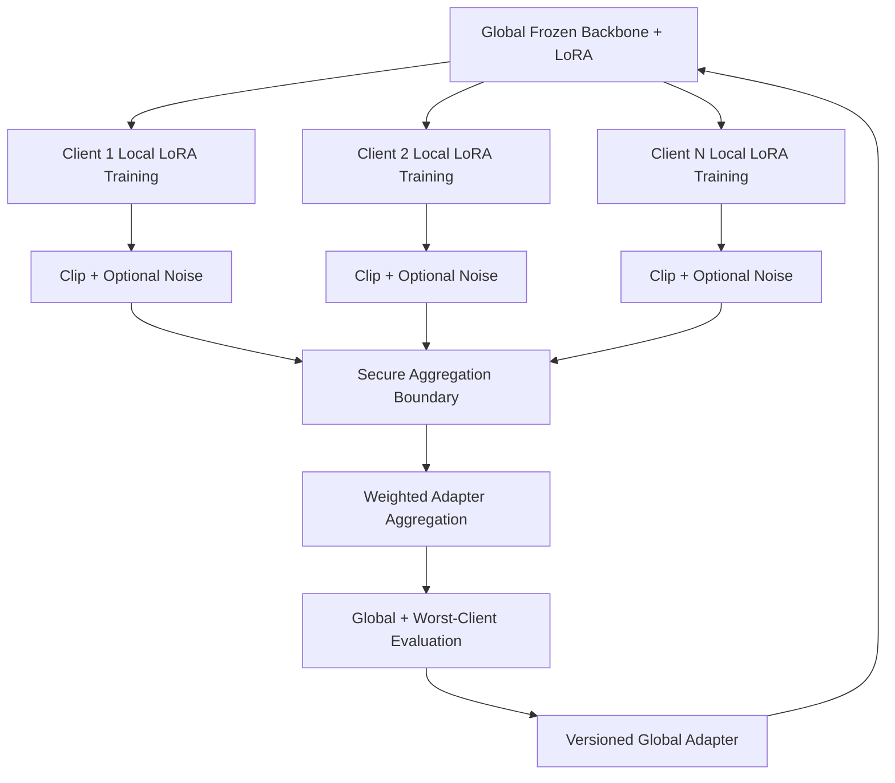

# FederatedLLM-Lite — Architecture

## 1. Executive summary
FederatedLLM-Lite is a privacy-aware federated parameter-efficient fine-tuning architecture for adapting small/foundation language models across organizations or devices that cannot centralize raw training data. The local implementation separates a frozen shared backbone, trainable LoRA adapters, client-local optimization, and server-side aggregation/governance.

## 2. Local architecture

## 3. Why federated PEFT
Full-model federated tuning is expensive in memory, compute and network transfer. LoRA limits trainable and communicated state while keeping the base model identical across clients. The global adapter becomes the primary federated artifact.

## 4. Research rationale
Recent private FedLoRA research shows naive averaging is not a solved problem: asymmetric LoRA factors can exhibit coupled optimization, DP noise can amplify instability, non-IID updates may disagree, and aggregated models can become sharp. This implementation provides an auditable FedAvg-LoRA baseline and leaves alternating/frozen-factor variants as experiments rather than claiming those research results.

## 5. Local model
The bundled tiny model is: hashed token IDs → frozen embedding → LoRA-injected frozen projection → tanh → LoRA-injected frozen classifier head. Only `lora_a` and `lora_b` train. It is an engineering vehicle for adapter-state extraction, local optimization, aggregation and privacy mechanics—not a benchmark-scale LLM.

## 6. Non-IID simulation
Client data is split with a Dirichlet label-skew distribution. Lower alpha means greater heterogeneity. The system reports global, mean-client and worst-client quality so a favorable average cannot hide a weak client cohort.

## 7. Round lifecycle
1. Publish global adapter.
2. Each client loads the same frozen backbone + adapter.
3. Train LoRA parameters only.
4. Compute local adapter delta.
5. Measure and clip update norm.
6. Optionally add Gaussian noise.
7. Enter secure-aggregation simulation.
8. Aggregate by example count.
9. Evaluate global and per-client quality.
10. Version the next global adapter.

## 8. Privacy model
Federated learning avoids normal centralization of raw examples, but does not automatically prevent gradient leakage, membership inference, memorization, malicious clients, poisoning or server inference. The project demonstrates clipping and Gaussian noise but does not implement a formal privacy accountant and therefore does not claim an `(epsilon, delta)` differential-privacy guarantee.

## 9. Secure aggregation
Pairwise random masks algebraically cancel in the aggregate. This demonstrates the secure-aggregation property but is intentionally not a cryptographic protocol. Production requires reviewed protocols covering key exchange, client dropout and collusion assumptions.

## 10. Evaluation
Model quality: task metric, mean-client quality, worst-client quality. Federated convergence: quality by round, update norms, clipping rate, update variance and rounds-to-target. Privacy: formal epsilon/delta when implemented, canary memorization and membership-inference tests. Systems: bytes/round, client wall time, stragglers, GPU/CPU utilization and aggregation latency.

## 11. Experiment matrix
Compare centralized LoRA, vanilla FedAvg-LoRA, clipped FedAvg-LoRA, clipped+noised FedAvg-LoRA, a frozen/alternating-factor research adaptation, and compressed/quantized adapter transmission. Sweep client count, Dirichlet alpha, local epochs, LoRA rank, participation fraction and quantization.

# Production Scaling Architecture

## 12. State separation
Stateless: API gateway, orchestration API, client-eligibility service, evaluation workers, registry API. Stateful: federation/round metadata, adapter/model registry, participation history, privacy-accounting state, audit logs and evaluation artifacts. Raw client datasets stay outside the central training plane.

## 13. Horizontal scaling
Scale orchestration/API replicas by request rate, aggregation workers by concurrent federations, evaluation workers by queue depth, telemetry by event volume, and client trainers naturally across participants. Partition coordination state by `federation_id`.

## 14. Vertical scaling
Use larger nodes mainly for global evaluation, large base-model validation and larger adapter aggregation. Aggregation itself is generally much cheaper than client fine-tuning.

## 15. GPU serving and heterogeneous clients
Clients report accelerator type, RAM/VRAM, supported precision, sequence limits and allowed runtime window. Scheduling assigns compatible profiles across CPU, small GPU, large GPU and edge accelerators.

## 16. Batching
Clients use micro-batching, gradient accumulation, sequence bucketing and packing where safe. Server aggregation batches tensors per federation/round. Global evaluation batches separately.

## 17. Caching
Cache immutable base models by checksum, tokenizer assets, local preprocessing artifacts, adapters and evaluation datasets. Do not centrally cache sensitive raw training examples.

## 18. Quantization
Support 8/4-bit frozen backbones, FP16/BF16 adapter training where stable, and optionally quantized adapter transmission. Benchmark convergence, update drift, privacy interaction and communication savings before promotion.

## 19. Queues/eventing
Use Kafka, NATS, RabbitMQ or equivalent with events such as `round.created`, `client.selected`, `client.completed`, `aggregate.ready`, `evaluation.completed`, `adapter.promoted`. Jobs are idempotent by federation, round, client and parent model version.

## 20. Databases and storage
PostgreSQL stores federations, rounds, clients, adapter/model versions, privacy budgets, evaluation summaries and rollout state. Object storage holds global adapters, signed manifests and evaluation reports. A vector DB is unnecessary unless the downstream application itself needs retrieval.

## 21. Ingestion
Client registration performs identity verification, capability registration, policy assignment, base-model eligibility and federation membership. Clients may publish approved metadata such as sample count/schema version, but not raw examples.

## 22. Concurrency
Prevent concurrent rounds from mutating the same global adapter. Use round leases, optimistic version checks, unique parent versions and transactional promotion. Clients reject jobs whose parent model checksum does not match.

## 23. Load balancing
Ordinary L7 balancing works for stateless APIs. Aggregation jobs need federation affinity. GPU evaluation uses accelerator-aware scheduling instead of generic round-robin.

## 24. Autoscaling
Signals include queued client jobs, completed-client percentage, aggregation queue depth, evaluator GPU utilization, p95 round closure time and concurrent federations.

## 25. Stragglers / partial participation
Use minimum completion quorum, round deadlines, client sampling, stale-update rejection and optionally bounded-staleness asynchronous FL. Report participation bias because unavailable clients may represent distinct populations.

## 26. High availability
Run replicated stateless services, HA PostgreSQL, replicated queue/object storage and leader election for round coordinators. Durable round state allows safe coordinator recovery.

## 27. Fault tolerance
Client failures retry only idempotent jobs within deadline. Aggregation can be recomputed from immutable accepted-update manifests. Failed evaluation never promotes an adapter. Duplicate updates are rejected.

## 28. Distributed processing
Each client is an independent compute boundary. Large clients may use DDP/FSDP/DeepSpeed internally, but only approved federated update artifacts cross organizations.

## 29. Model registry/versioning
Version base-model checksum, tokenizer, LoRA config, parent adapter, aggregation strategy, participating clients, privacy configuration, evaluation results and code/container version. Recommended hierarchy: `base_model → federation → global_adapter_vN`.

## 30. CI/CD
Unit tests → deterministic local federation → secure-aggregation tests → privacy tests → client compatibility matrix → non-IID convergence benchmark → memorization/leakage tests → container/security scan → staging federation → canary → controlled promotion.

## 31. Telemetry
Control-plane metrics: round states, dropout, retries and aggregation latency. Model metrics: global/client quality, worst-client quality, update norms, clipping fraction and update similarity. Privacy metrics: epsilon/delta when formal DP exists, budget consumption and secure-aggregation failures. Infrastructure: CPU/GPU, bytes, round duration and object/registry latency. Use OpenTelemetry correlation IDs for federation/round/client.

## 32. IAM and secrets
Use OIDC/SPIFFE/workload identity, short-lived credentials, mTLS, KMS-backed key management, per-client certificates and a secrets manager. Aggregators should not automatically have access to client data stores.

## 33. Security
Protect against poisoned updates, model replacement, replay, compromised coordinators, gradient leakage and membership inference with signed jobs/manifests, mTLS, secure aggregation, update validation, anomaly detection, replay protection, provenance and least privilege.

## 34. Multi-tenancy
Shared control plane: namespace DB rows, object prefixes, keys and privacy policies by tenant/federation. Regulated customers may require dedicated database, bucket, aggregation service, KMS keys, VPC and region.

## 35. Cost/performance
Primary levers: adapter rank, participation fraction, local epochs, communication frequency, update quantization, client selection and base-model size. Track quality gain per GB transferred, client-hour, GPU-hour and rounds-to-target.

## 36. Backup/DR
Back up registry metadata, global adapters, round manifests, signed policies, evaluation results, privacy-accounting state and audit trails. Client raw data remains under client governance. Recovery reconstructs the latest promoted adapter from immutable base model + lineage + adapter artifact.

## 37. Rollout/rollback
Rollout: offline quality/privacy/safety gate → shadow inference → canary tenants/devices → progressive percentage → full promotion. Do not promote solely on mean improvement; gate worst-client, privacy and safety regressions. Rollback is a registry pointer change to the previous compatible global adapter plus serving/tokenizer config.

## 38. Cloud / on-prem / hybrid
Cloud fits centralized coordination and elastic evaluation. On-prem fits sovereignty/restricted networks. Hybrid is often ideal: client training remains local/on-prem while a cloud control plane coordinates metadata and approved adapter updates.

# ADRs

## ADR-001 — Federate adapters, not full backbone
Decision: exchange LoRA updates only. Reason: lower compute/network cost. Trade-off: adapter aggregation has unique optimization pathologies.

## ADR-002 — Non-IID is default
Decision: every benchmark includes heterogeneous client distributions. Reason: IID federation is misleadingly easy.

## ADR-003 — Secure aggregation and DP are separate
Decision: model them as distinct controls. Reason: secure aggregation hides individual updates from the coordinator; DP limits information leakage from aggregate/output.

## ADR-004 — Privacy claims need formal accounting
Decision: bundled noise is educational, not a formal DP guarantee. Reason: meaningful epsilon/delta requires a validated mechanism/accountant.

## ADR-005 — Worst-client quality is a promotion gate
Decision: report and gate weakest client cohorts. Reason: average quality can improve while minority clients degrade.

## ADR-006 — Heterogeneous clients are expected
Decision: capability-aware selection and straggler policy are core architecture. Reason: hardware/network availability affects model quality and convergence.

## ADR-007 — Raw client data never enters the central training plane
Decision: central services ingest approved updates/metadata only. Reason: preserve the federated trust boundary.

## 39. Next extensions
Replace tiny model with 0.5B SLM + PEFT; add audited DP accounting; integrate Flower; benchmark alternating/frozen-factor LoRA; add malicious-client/robust aggregation tests; add asynchronous participation; quantize updates; add memorization canaries; add personalized adapters; sign update manifests.
