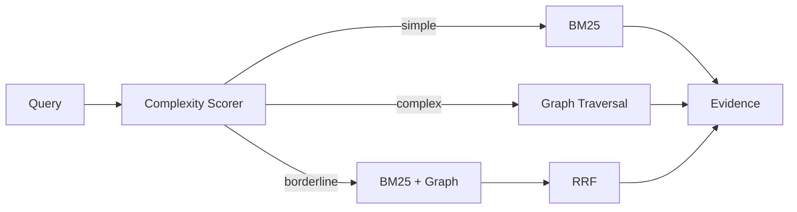

# GraphRAG-Enterprise — Architecture

## Local design

## Rationale
The key ADR is adaptive graph usage. Recent work shows GraphRAG can be slower and worse than vanilla RAG when graph traversal is applied indiscriminately. Query complexity therefore controls retrieval mode.

## Local components
- BM25 for exact/simple retrieval
- explicit knowledge graph
- entity seeding
- bounded 2-hop traversal
- RRF for borderline queries
- path provenance
- separate retrieval metrics

## Trade-offs
Graph retrieval improves connected multi-hop questions but increases index complexity and path noise. Lexical retrieval is faster and often superior for direct fact lookup. Hybrid mode hedges uncertainty.

# Production Scaling Architecture

## State separation
Stateless: API, router, query planner, reranker.
Stateful: lexical index, vector index, graph store, document store, index registry, evaluation datasets.

## Horizontal/vertical scaling
Scale stateless query services horizontally. Partition graph workloads by tenant/domain. Vertically scale graph/query nodes only when traversal memory demands it.

## GPU serving
Embeddings/rerankers use separate GPU pools. Graph traversal remains CPU/memory oriented. Local deployments may omit GPUs entirely.

## Batching/caching/quantization
Batch document embeddings offline; cache entity linking and repeated query embeddings; quantize encoders after regression testing.

## Queues
Async ingestion: parse → entity/relation extraction → graph update → lexical/vector index → validation → index publication.

## Storage
PostgreSQL for metadata/lineage; Neo4j/ArangoDB/Neptune-style graph store; OpenSearch for lexical search; Qdrant/pgvector for dense retrieval; object storage for canonical documents.

## Ingestion
Use immutable source IDs and idempotent document versions. Build graph/index versions side by side and atomically promote aliases.

## Concurrency/load balancing
Route graph-heavy queries to graph-capable workers. Protect graph stores with traversal budgets and timeouts. Tenant-aware load balancing prevents noisy-neighbor graph workloads.

## Autoscaling
Signals: QPS, p95 route latency, graph traversal latency, embedding queue depth, graph CPU/memory, cache hit rate.

## HA/fault tolerance
Replicated APIs, graph replicas, durable ingestion queues, idempotent index builds, dead-letter queues and fallback to lexical retrieval if graph service is unavailable.

## Distributed processing
Large graph builds use partitioned entity/relation extraction and graph compaction. Avoid cross-partition traversals without explicit budget.

## Model registry/versioning
Version entity extractor, relation extractor, embedding model, graph schema, router thresholds, RRF config, corpus snapshot and evaluation set.

## CI/CD
Unit tests → retrieval benchmark → route benchmark → path-quality checks → latency gates → security scan → shadow queries → canary → alias promotion.

## Telemetry
OpenTelemetry spans per route. Track route distribution, recall/MRR, graph-path length, zero-result rate, fallback rate, latency, graph saturation and index freshness.

## IAM/secrets
OIDC/workload identity, secrets manager, TLS, least-privilege index access, tenant-scoped graph namespaces and immutable audit logs.

## Multi-tenancy
Shared stores require mandatory tenant filters. Regulated tenants may require dedicated graphs, indexes, buckets and keys.

## Cost/performance
Graph retrieval is invoked only when query complexity justifies it. Measure quality gain per additional millisecond and per index/storage cost.

## Backup/DR
Back up canonical documents, graph schema, graph snapshots, metadata and index manifests. Rebuild derived indexes from canonical sources.

## Rollout/rollback
Shadow new router/graph versions, compare route-specific quality, canary by tenant/query class, and rollback via index/config alias.

## Cloud/on-prem/hybrid
On-prem for sensitive enterprise graphs; cloud for elastic indexing and GPU embeddings; hybrid for local canonical data plus centrally managed approved indexes.

## ADRs
1. Graph retrieval is adaptive, not universal.
2. Retrieval quality is measured by route.
3. Graph path provenance is preserved.
4. Derived indexes are versioned and rebuildable.
5. Lexical fallback is mandatory for graph-service failure.
