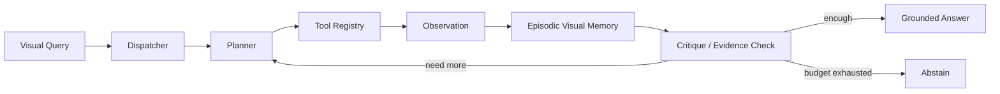

# VisionAgent-Studio — Architecture

## Local design

## Rationale
Modern multimodal agents increasingly externalize perception into tools and memory. PixelCraft uses dispatcher/planner/reasoner/critics plus visual tools; TraceR1 emphasizes anticipatory planning; newer multimodal-agent work externalizes visual information into retrievable memory.

The local implementation captures those engineering principles without requiring a large VLM.

## Reliability
- finite step budget
- explicit tool registry
- structured trace
- confidence threshold
- memory rather than endlessly appending images
- abstention on insufficient evidence

# Production Scaling Architecture

## State separation
Stateless: API, planner, policy engine.
Stateful: image/object store, episodic visual memory, task traces, model registry, tool metadata.

## Horizontal/vertical scaling
Scale APIs/planners horizontally. Scale VLM/CV workers by GPU utilization. Vertical scaling is useful for large vision encoders/VLMs.

## GPU serving
Separate pools for detector/OCR/VLM/reasoner. Use Triton or optimized model servers where batching is measurable.

## Batching/caching/quantization
Batch image embeddings/OCR, cache immutable visual observations keyed by image hash+model version, quantize VLMs after accuracy regression.

## Queues
Long visual tasks use durable queues. Tool calls carry task IDs, budgets, deadlines and idempotency keys.

## Storage
Object storage for images/video; PostgreSQL for tasks/traces; vector store for visual memory; optional search index for OCR/captions.

## Ingestion
Malware/format validation → image normalization → optional precompute OCR/detection/embedding → publish visual memory.

## Concurrency/load balancing
Bound tool concurrency per task and tenant. GPU-aware load balancing prevents one long vision task from starving interactive traffic.

## Autoscaling
Signals: tool queue depth, GPU utilization, p95 tool latency, task backlog and active memory sessions.

## HA/fault tolerance
Replicated APIs, durable task state, idempotent tools, retries with deadlines, tool-specific circuit breakers and graceful abstention.

## Distributed processing
Large image/video batches shard by asset/frame group. Preserve ordering only where temporal reasoning requires it.

## Model registry/versioning
Version detectors, OCR, VLM, prompt/policy, tool schemas, memory encoder and evaluation suite.

## CI/CD
Unit tests → synthetic visual benchmark → tool-selection benchmark → groundedness/citation benchmark → latency/VRAM gate → security → shadow → canary.

## Telemetry
Trace every tool call. Monitor tool selection, retry rate, memory hits, answer confidence, abstention, hallucination/grounding metrics, latency and GPU memory.

## IAM/secrets
OIDC/workload identity, signed object access, secrets manager, least-privilege tool credentials and immutable audit logs.

## Multi-tenancy
Tenant-scoped asset stores, memories, traces and caches. Dedicated GPU pools/storage for regulated tenants where needed.

## Cost/performance
Prefer cheap CV tools before expensive VLM calls. Reuse visual observations from memory. Track cost/latency per correctly solved task.

## Backup/DR
Back up task metadata, memory indexes, policies and model lineage. Canonical media follows retention requirements.

## Rollout/rollback
Shadow new planners/tools, canary by task family, compare success/tool-call count, and rollback via policy/model registry pointer.

## Cloud/on-prem/hybrid
On-prem for sensitive industrial/medical imagery; cloud for elastic GPU vision workloads; hybrid for edge perception plus central orchestration.

## ADRs
1. Visual tools are explicit and policy-controlled.
2. Visual memory is externalized and reusable.
3. Tool loops are bounded.
4. Expensive VLM calls are not the default first action.
5. Every answer is traceable to observations.
