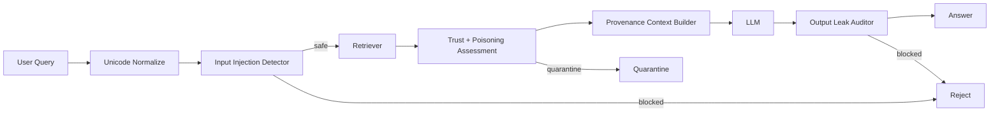

# RAGGuard-Local — Architecture

## Local design

The system uses defense in depth because direct-input filtering cannot stop indirect injection embedded in retrieved content.

## Rationale and trade-offs
Rule-based detectors are fast and explainable but attackers can paraphrase them. Production augments them with learned semantic detectors, provenance/trust scores, retrieval consistency and output-policy models. Hard filtering minimizes attack surface but can hurt recall; soft trust demotion is useful for borderline documents.

## Evaluation
Track attack success rate, benign false-positive rate, poisoned-document retrieval rate, quarantine precision/recall, secret-leak rate, latency overhead and quality degradation on clean traffic.

# Production Scaling Architecture

## State separation
Stateless: normalization, guard APIs, policy evaluation. Stateful: source trust registry, document provenance, quarantine store, security-event history, policy/model registry.

## Horizontal/vertical scaling
Horizontally scale stateless guards. Separate semantic guard-model GPU pools from lexical/rule detectors. Vertically scale only heavy security classifiers/rerankers.

## GPU serving
Use separate small guard models from primary LLMs. Batch classification requests with strict latency SLOs and quantize only after adversarial regression tests.

## Batching/caching/quantization
Cache normalized documents and document security assessments by content hash + policy/model version. Batch semantic scanning for ingestion. Never cache tenant-authorized results across tenants.

## Queues
Ingestion security runs asynchronously: upload → malware scan → normalization → injection/poison scan → provenance scoring → index/quarantine.

## Databases/vector/object storage
PostgreSQL for policy/provenance/trust, object storage for quarantined artifacts, search/vector stores for approved content, security lake for audit events.

## Ingestion
All external knowledge enters through a security gate before index publication. Promotion is atomic and versioned.

## Concurrency/load balancing
Rate-limit hostile tenants, enforce retrieval budgets and route security-model traffic independently of generation traffic.

## Autoscaling
Signals: guard QPS, p95 guard latency, quarantine queue depth, semantic detector GPU utilization and attack-event rate.

## HA/fault tolerance
Fail closed for privileged tool actions and secret-bearing contexts. For ordinary Q&A degrade to trusted-source-only retrieval if a secondary guard is down.

## Distributed processing
Large knowledge bases scan documents in parallel by immutable content hash. Promotion to searchable indexes is atomic after security gates.

## Model registry/versioning
Version normalization rules, injection signatures, semantic detector, source-trust policy, output policy, index version and red-team benchmark.

## CI/CD
Unit tests → benign corpus → injection corpus → Unicode/adversarial obfuscation suite → poisoning benchmark → latency gates → shadow → canary.

## Telemetry
OpenTelemetry spans for normalize/retrieve/assess/assemble/generate/audit. Track ASR, FPR, quarantine rate, source trust, output blocks, latency and policy version.

## IAM/secrets
OIDC/workload identity, KMS-backed secrets, tenant-scoped index permissions, signed ingestion identities and immutable audit logs.

## Multi-tenancy
Trust registries, caches, indexes and quarantine stores are tenant-scoped. High-risk tenants may require dedicated guard-model and storage planes.

## Cost/performance
Run cheap normalization/rules first, semantic guards only on uncertain inputs/documents and expensive red-team analysis asynchronously.

## Backup/DR
Back up policy, provenance, trust, quarantine metadata and audit records. Approved indexes are rebuildable from canonical source data.

## Rollout/rollback
Shadow new guard rules/models, measure clean-quality impact and ASR, canary by tenant and rollback by policy-registry pointer.

## Cloud/on-prem/hybrid
On-prem for regulated knowledge bases; cloud for elastic security-model serving; hybrid for local retrieval with centrally distributed signed guard policies.

## ADRs
1. Secure the whole RAG knowledge-access lifecycle, not only user input.
2. Retrieved content is data, never operator instruction.
3. Source provenance and trust are first-class.
4. Security controls are independently versioned from the base LLM.
5. Privileged actions fail closed.
