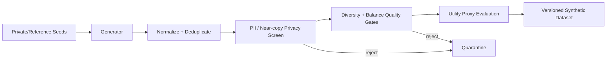

# DataSynth-LLM — Architecture

## Local design

The local generator is deterministic and template-based so governance/evaluation can run without model downloads. A production generator can be an open local SLM or a formally private candidate-generation mechanism.

## Rationale and trade-offs
Synthetic data is not automatically private, unbiased, diverse or useful. Generation and acceptance are separate. Near-copy screening is heuristic; production privacy claims require formal mechanisms and empirical attacks.

## Evaluation
Track TSTR, diversity, label balance, nearest-reference overlap, PII leak rate, duplicate rate, fairness slices, membership-inference risk and downstream calibration.

# Production Scaling Architecture

## State separation
Stateless: generator gateway, validators, scorers. Stateful: private seed vault, candidate store, dataset registry, privacy accountant, evaluation history and lineage metadata.

## Horizontal/vertical scaling
Horizontally scale candidate generators and validators. Keep private-seed access in a restricted plane. Vertically scale only model-serving GPUs.

## GPU serving
Separate generation models from embedding/privacy scorers. Batch prompts with policy-aware isolation and quantize after utility/privacy regression.

## Batching/caching/quantization
Batch candidate generation and novelty checks. Cache reference embeddings by dataset version, never raw private prompts outside approved storage.

## Queues
Pipeline events: generation.requested → candidate.created → privacy.checked → quality.checked → utility.evaluated → dataset.promoted.

## Databases/vector/object storage
Encrypted object storage for approved datasets, PostgreSQL for lineage/policy, vector index for near-duplicate detection and restricted seed vault for private inputs.

## Ingestion
Private/reference data is profiled, classified and access-controlled before becoming seed material. Restricted data never enters general-purpose logs.

## Concurrency/load balancing
Per-dataset quotas, bounded generation jobs and tenant-aware batch schedulers prevent leakage through mixed-tenant prompt batches.

## Autoscaling
Signals: candidate queue depth, GPU utilization, validator latency, dataset-build SLA and vector-search load.

## HA/fault tolerance
Durable candidate states, idempotent generation IDs, retryable validators and fail-closed promotion when privacy checks are unavailable.

## Distributed processing
Large corpora shard candidate generation/evaluation by class/domain. Aggregate only approved metrics and dataset manifests.

## Model registry/versioning
Version generator model, prompt/template, sampling config, private-seed snapshot ID, privacy policy, dedupe encoder, validators and downstream utility benchmark.

## CI/CD
Unit tests → leakage canaries → dedupe benchmark → fairness slices → TSTR utility gate → privacy attacks → latency/cost → canary dataset → promote.

## Telemetry
Track generation yield, reject reasons, near-copy distribution, PII hits, class balance, utility, fairness, cost/token, GPU utilization and dataset lineage.

## IAM/secrets
Strict seed-vault ACLs, workload identity, KMS encryption, short-lived credentials and immutable access audits.

## Multi-tenancy
Separate seed stores, caches, embeddings and dataset registries by tenant. Never co-batch private seed prompts across tenants without an explicit threat model.

## Cost/performance
Optimize accepted useful examples per GPU-hour, not raw generated count. Stop generation when marginal diversity/utility saturates.

## Backup/DR
Back up dataset manifests, approved synthetic corpora, privacy-accounting state and lineage. Private seeds follow stricter retention.

## Rollout/rollback
Treat datasets like models: version them, run downstream shadow training, canary model retraining, compare regressions and rollback to the previous dataset manifest.

## Cloud/on-prem/hybrid
On-prem for sensitive seeds; cloud for public-seed/high-scale generation; hybrid for private candidate selection locally with approved synthetic outputs promoted centrally.

## ADRs
1. Generation and acceptance are separate stages.
2. Synthetic does not imply private.
3. Near-copy/PII checks precede utility evaluation.
4. Dataset versions are immutable promoted artifacts.
5. Formal privacy claims require formal privacy mechanisms/accounting.
