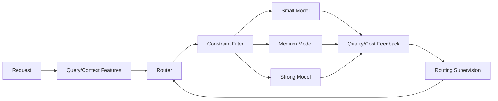

# ModelRouter-Local — Architecture

## Local design

The router is separated from target models. It estimates whether a stronger model is likely to deliver enough marginal quality gain to justify additional cost/latency, then applies health, reliability, latency and budget constraints.

## Evaluation
Track mean quality, mean cost, strong-model call rate, quality regret vs oracle, latency SLO violations, route confusion, reliability incidents and calibration.

# Production Scaling Architecture
## State separation
Stateless router APIs and policy evaluators; stateful model registry, online feature store, routing logs, cost ledger, quality labels and experiment registry.

## Horizontal/vertical scaling
Scale routers horizontally by QPS and model-serving pools independently. Vertical GPU scaling applies to target models, not the lightweight router.

## GPU serving
Use vLLM/TGI/Triton/Ollama-class pools. Keep small/medium/strong tiers separate for independent autoscaling and admission control.

## Batching/caching/quantization
Use continuous batching per model pool. Cache safe immutable prompt features/responses with model+prompt+tenant keys. Quantize SLMs after task-regression testing.

## Queues
Interactive routing is synchronous; batch/long tasks and feedback-supervision generation use durable queues.

## Databases/storage
PostgreSQL for registry, policies, budgets and decisions; object storage for eval datasets/models; optional feature store; metrics store for latency/cost/quality.

## Ingestion
Register models with capability, cost, latency, safety and health metadata. Promotion requires benchmark and security gates.

## Concurrency/load balancing
Router selects a model tier, then a load balancer chooses a healthy replica. Enforce per-tenant concurrency and strong-model quotas.

## Autoscaling
Router replicas scale on CPU/QPS; model pools on queue depth, token throughput, p95 TTFT, GPU utilization and KV-cache pressure.

## HA/fault tolerance
Multiple router replicas, replicated registry, circuit breakers and a deterministic static fallback if router inference fails.

## Distributed processing
Offline supervision generation and benchmark replay shard by request; online decisions remain low-latency/stateless.

## Model registry/versioning
Version target model, quantization, serving runtime, router model, feature schema, thresholds, cost table and evaluation corpus together.

## CI/CD
Unit tests → replay benchmark → quality/cost frontier → latency/load → failure injection → safety regression → shadow routing → canary → promote.

## Telemetry
Trace request → router → model → response; track route share, quality proxy, fallback, regret, token usage, cost, latency, failures, queues and drift.

## IAM/secrets
Workload identity, secret manager, least privilege, tenant-scoped budgets and immutable routing audit logs.

## Multi-tenancy
Per-tenant model allowlists, budgets, latency objectives, data-region rules and personalization features.

## Cost/performance
Optimize a constrained Pareto frontier rather than cost alone. Strong-model call rate is a primary controllable cost lever.

## Backup/DR
Back up registry, policies, cost ledgers, router models and evaluation data; target model weights follow registry/object-store DR policy.

## Rollout/rollback
Shadow new routers, compare counterfactual decisions, canary by tenant and rollback via policy pointer.

## Cloud/on-prem/hybrid
On-prem for local private SLMs, cloud for elastic frontier models, hybrid for privacy/data-region-aware routing across both.

## ADRs
1. Routing is separate from inference.
2. Marginal gain is preferred to raw difficulty.
3. Health/reliability/budget constraints override learned preference.
4. Router quality is evaluated on cost-quality Pareto metrics.
5. Every route is versioned and auditable.
