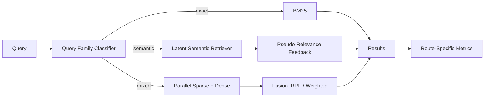

# HybridSearch-RAG — Architecture

## Local design

## Why this differs from earlier hybrid-search projects
The earlier portfolio projects established sparse+dense fusion and citation-preserving RAG. Week 21 focuses on adaptive retrieval policy and retrieval economics: classify query shape, spend only the candidate budget needed, compare fusion algorithms, use PRF selectively, and report metrics per route.

## Dense proxy
For deterministic offline execution, TF-IDF + TruncatedSVD approximates a latent semantic space. This is not claimed to equal a modern embedding model. Production replaces it with a benchmarked open encoder.

## Query families
Exact: identifiers/error codes/part numbers. Semantic: paraphrases/conceptual questions. Mixed: identifiers plus descriptive constraints or technical terms plus semantic intent.

## Fusion
RRF is the default because it combines rank positions instead of incompatible BM25/cosine score scales. Weighted fusion is retained for ablation and is normalized first.

## PRF
Pseudo-relevance feedback expands semantic/mixed queries using high-ranked sparse evidence; it is disabled for exact queries to avoid diluting identifier precision.

## Evaluation
Primary metrics: Recall@5, MRR, nDCG@5. Also track route accuracy, candidates/query, p95 latency, fusion lift, PRF lift/regression, exact-ID success and semantic paraphrase slices.

# Production Scaling Architecture
## State separation
Stateless query router, fusion and reranker APIs; stateful sparse/vector indexes, query analytics, index registry and evaluation corpora.

## Horizontal/vertical scaling
Run sparse and dense retrieval independently and horizontally. Rerankers scale separately. Vertical memory scaling is mainly an index concern.

## GPU serving
Dense encoders and cross-encoders may use GPU pools; sparse search and routing remain CPU-oriented.

## Batching/caching/quantization
Batch embeddings/reranking, cache query embeddings and safe immutable retrieval results by tenant+index+policy version, quantize encoders only after relevance tests.

## Queues
Ingestion uses durable async pipelines: parse → chunk → metadata/ACL → sparse index → dense embeddings → validation → atomic publication.

## Databases/vector/object storage
OpenSearch/Elasticsearch for sparse, Qdrant/pgvector/Milvus for dense, PostgreSQL for metadata/lineage, object storage for canonical documents.

## Ingestion
Version chunking, tokenization, embedding model and ACL metadata. Never expose a partially built hybrid index.

## Concurrency/load balancing
Run sparse+dense branches in parallel for mixed queries and apply branch timeouts. Degrade to one healthy branch if the other exceeds SLO.

## Autoscaling
Signals: query QPS, sparse/dense p95, encoder GPU utilization, reranker queue, index CPU/memory and cache hit rate.

## HA/fault tolerance
Replicated query services/index replicas. Hybrid queries can degrade gracefully to sparse-only or dense-only with explicit telemetry.

## Distributed processing
Large corpus ingestion shards by document ID. Dense workers batch by token length. Index compaction/rebalancing stays separate from interactive queries.

## Model registry/versioning
Version query-family policy, sparse tokenizer, dense model, fusion config, PRF policy, reranker, corpus snapshot and evaluation suite together.

## CI/CD
Unit tests → relevance benchmark → per-family benchmark → fusion/PRF ablations → latency/load → failure injection → shadow → canary → promote.

## Telemetry
OpenTelemetry spans for routing, sparse, dense, PRF, fusion and reranking. Track route mix, Recall/nDCG, exact-ID failures, timeouts, fusion lift and drift.

## IAM/secrets
Document ACL filters must be enforced inside each retrieval branch. Use workload identity, encrypted indexes, secrets manager and audit logs.

## Multi-tenancy
Tenant-aware indexes/filters/cache keys; heavy tenants can receive dedicated shards/collections.

## Cost/performance
Candidate budgets are query-family dependent. Do not pay dense/reranker cost for queries BM25 answers reliably. Track quality gain per millisecond and per reranked candidate.

## Backup/DR
Back up canonical documents, metadata/ACLs, index manifests and evaluation judgments. Rebuild sparse/dense indexes from canonical sources.

## Rollout/rollback
Build new index/model/policy versions side by side, shadow traffic, compare route-specific metrics, then switch aliases. Roll back the policy/index bundle atomically.

## Cloud/on-prem/hybrid
On-prem for sensitive corpora and predictable workloads; cloud for elastic embedding/reranking; hybrid for local searchable data plus centrally managed model/policy releases.

## ADRs
1. Query-family routing is a first-class retrieval stage.
2. Exact identifiers default to sparse retrieval.
3. RRF is the default fusion for mixed queries.
4. PRF is selective, never unconditional.
5. Relevance and latency are measured per route.
