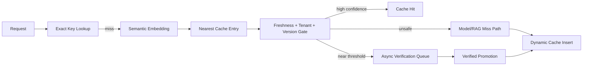

# LLMCache-Engine — Architecture

## Local design

## Rationale / ADRs
1. Static curated and dynamic caches are separate tiers.
2. One global similarity threshold is insufficient; calibration is workload-specific.
3. Freshness risk is checked independently of semantic similarity.
4. Tenant/model/prompt versions are part of cache identity.
5. Near-threshold candidates are verified asynchronously, never trusted blindly on the critical path.

## Evaluation
Precision of reuse, cache-hit ratio, false-reuse rate, stale-error rate, avoided inference, latency saved, verification yield, per-tenant hit rate, and collision-attack success rate.

# Production Scaling Architecture

## State separation
Stateless lookup/policy APIs; stateful cache shards, embedding index, verifier queue, registry and metrics store.

## Horizontal/vertical scaling
Shard cache by tenant/hash; replicate hot shards. Lookup services scale horizontally. Vertical scale helps large embedding indexes but should not replace sharding.

## GPU serving
Embedding and optional verifier/judge models use independent GPU pools. Cache lookup remains CPU/memory bound.

## Batching/caching/quantization
Batch embeddings and async verification. Quantize encoders/judges only after cache precision regression tests.

## Queues
Near-threshold verification and offline promotion use durable queues with idempotency keys.

## Storage
Redis/KeyDB for hot exact cache; vector DB for semantic candidates; PostgreSQL for metadata/lineage; object storage for evaluation traces.

## Ingestion
Only cache responses that pass safety/provenance policy. Curated static cache is built offline from vetted traffic.

## Concurrency/load balancing
Use shard-aware routing, per-tenant quotas and stampede protection for identical misses.

## Autoscaling
Signals: QPS, miss rate, verification backlog, embedding latency, cache memory pressure and verifier GPU utilization.

## HA/fault tolerance
Replicated cache nodes, quorum/replica reads where needed, durable promotion queue. Cache failure degrades to model/RAG rather than serving uncertain entries.

## Distributed processing
Offline calibration and trace replay shard by request/day/tenant.

## Model registry/versioning
Version encoder, thresholds, verifier, prompt version, target model and cache policy together.

## CI/CD
Unit tests → trace replay → precision/hit-ratio gate → collision/freshness tests → latency/load → shadow → canary.

## Telemetry
Trace hit type, score, freshness risk, tenant, model version, latency saved and verifier outcome.

## IAM/secrets
Workload identity, tenant isolation, encrypted cache payloads, secrets manager and immutable audit logs.

## Multi-tenancy
Tenant-scoped cache keys, vector namespaces and budgets. No cross-tenant semantic reuse unless explicitly allowed.

## Cost/performance
Optimize verified cache-hit ratio at a minimum precision target, not hit ratio alone.

## Backup/DR
Back up curated cache manifests, policy/thresholds and metadata. Dynamic cache is rebuildable from traffic where retention allows.

## Rollout/rollback
Shadow new thresholds/encoders, compare false reuse and hit ratio, then switch policy pointers atomically.

## Cloud/on-prem/hybrid
On-prem for sensitive prompts/responses; cloud for elastic verifier/embedding serving; hybrid for local hot cache with centrally distributed signed policies.
