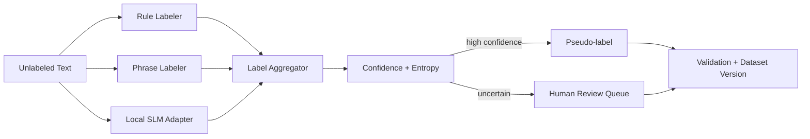

# AutoLabel-NLP — Architecture

## Local design

## Rationale / ADRs
1. Multiple independent labelers are preferable to a single auto-labeler.
2. Disagreement is a signal, not an error to hide.
3. Low-confidence examples are abstained/reviewed rather than forcibly labeled.
4. Human review budget should target uncertain/high-value examples.
5. Pseudo-labels and human labels retain provenance.

## Evaluation
Coverage, accepted-label accuracy, abstention rate, review yield, class balance, per-class precision/recall, annotator agreement, calibration and downstream model utility.

# Production Scaling Architecture

## State separation
Stateless annotator/aggregation APIs; stateful item store, label/provenance DB, review queues, dataset registry and evaluation history.

## Horizontal/vertical scaling
Scale cheap labelers horizontally; route only difficult items to GPU-backed SLM/LLM annotators. Human review capacity is modeled separately.

## GPU serving
Small local annotator models use isolated GPU pools with batching. Quantization is allowed only after label-quality regression.

## Batching/caching
Batch annotation by domain/length; cache deterministic labeler outputs by item hash + labeler version.

## Queues
Ingestion → cheap labelers → disagreement scoring → expensive annotator if needed → human review → dataset promotion.

## Storage
PostgreSQL for items/labels/provenance, object storage for source datasets, vector store optionally for diversity/duplicate sampling.

## Ingestion
Normalize, deduplicate, redact restricted data, classify domain and assign immutable item IDs.

## Concurrency/load balancing
Per-tenant/domain queues and budgets. Avoid mixing restricted tenant data in shared prompts or batches.

## Autoscaling
Signals: unlabeled backlog, SLM queue depth, review backlog, GPU utilization and dataset SLA.

## HA/fault tolerance
Durable queues, idempotent item IDs, retryable annotators, and fail-to-review when critical labelers are unavailable.

## Distributed processing
Shard large corpora by item/domain. Aggregation is deterministic from immutable labeler outputs.

## Registry/versioning
Version label taxonomy, labelers, prompts, model checkpoints, aggregation policy, thresholds, review guidelines and dataset manifest.

## CI/CD
Unit tests → gold labeling benchmark → disagreement/calibration checks → class-balance gate → downstream utility test → shadow → canary dataset.

## Telemetry
Track per-labeler accuracy, disagreement, abstention, review yield, class skew, latency, cost and downstream utility.

## IAM/secrets
Workload identity, restricted source-data access, secrets manager, reviewer RBAC and immutable audit trails.

## Multi-tenancy
Separate item stores, caches, queues and dataset registries by tenant when data governance requires it.

## Cost/performance
Optimize correct accepted labels per GPU-hour and per human-review minute, not raw labels generated.

## Backup/DR
Back up source manifests, human labels, pseudo-label provenance, taxonomy and dataset registry. Recompute derived weak labels when possible.

## Rollout/rollback
Promote immutable dataset versions; retrain candidate models in shadow; rollback by dataset manifest pointer.

## Cloud/on-prem/hybrid
On-prem for sensitive annotation; cloud for scalable public-data labeling; hybrid for local private labelers plus centralized approved dataset governance.
