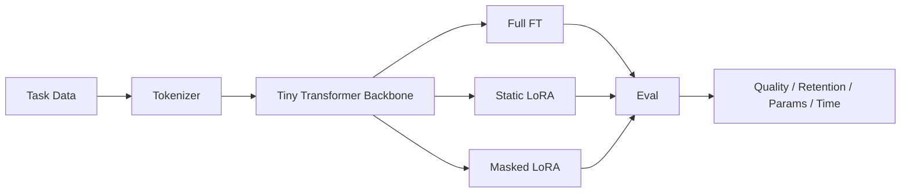

# TinyLLM-FineTuner — Architecture

## Local design

The project benchmarks adaptation strategy rather than assuming LoRA is always superior. Current research shows architecture/tokenizer choice, rank, and retention can materially alter PEFT outcomes.

## Trade-offs / ADRs
- Full fine-tuning gives maximum flexibility but updates all weights.
- LoRA reduces trainable state and storage.
- Dynamic/masked rank can reduce effective adaptation compute but introduces routing/masking complexity.
- Local benchmark uses a tiny encoder so mechanics are reproducible on CPU; production may substitute a 0.5B–3B open SLM.

# Production Scaling Architecture

## State separation
Stateless training-job API and evaluator; stateful dataset registry, base-model registry, adapter registry, experiment metadata and metrics.

## Horizontal / vertical scaling
Hyperparameter/rank experiments scale horizontally by job. Larger SLM training scales vertically on a GPU and, if needed, with distributed data/model parallelism.

## GPU serving
Use separate training and inference pools. vLLM/TGI/llama.cpp style serving handles promoted quantized models/adapters.

## Batching / caching / quantization
Micro-batch under VRAM limits, gradient accumulation, cached tokenization, 4/8-bit frozen backbones where validated, adapter-only checkpoints.

## Queues
Durable training queue with job IDs, cancellation, retries, resource profiles and idempotent output paths.

## Databases / object storage
PostgreSQL for runs/lineage; object storage for immutable datasets, adapters and evaluation reports; model registry for promoted versions.

## Ingestion
Validate schema/license/PII, freeze train/eval snapshots, hash dataset manifests and block mutable hidden state.

## Concurrency / load balancing
GPU-aware scheduler assigns jobs by memory requirement. Serving balances by KV-cache pressure, token throughput and adapter residency.

## Autoscaling
Training: queued GPU-hours. Serving: QPS, TTFT, tokens/sec, GPU memory, queue depth.

## HA / fault tolerance
Checkpoint adapters periodically, make jobs resumable, replicate registry/object store and separate experiment failure from model promotion.

## Distributed processing
Sharded dataset preprocessing; DDP/FSDP only when model size warrants it. Small local models should not pay distributed overhead unnecessarily.

## Model registry / versioning
Version base model hash, tokenizer, adapter method/rank, quantization, dataset snapshot, code/container and benchmark suite.

## CI/CD
Unit tests → smoke training → benchmark → retention/safety tests → latency/VRAM profiling → artifact scan → canary → promote.

## Telemetry
Track loss, eval quality, forgetting/retention, trainable ratio, GPU/RAM, tokens/sec, wall time, rank utilization and inference latency.

## IAM / secrets
Workload identity, secrets manager, signed model artifacts, least privilege to dataset/model buckets.

## Multi-tenancy
Tenant-isolated adapters, datasets, caches and registry namespaces; optionally dedicated training/serving pools.

## Cost / performance
Optimize quality gain per trainable parameter, GPU-hour and inference millisecond—not just raw benchmark accuracy.

## Backup / DR
Back up registry metadata, immutable dataset manifests and promoted adapters. Base models are restored by checksum/version.

## Rollout / rollback
Shadow or canary new adapters, compare against base and previous adapter, rollback by registry alias.

## Cloud / on-prem / hybrid
On-prem for sensitive specialization; cloud for burst GPU training; hybrid for local data prep plus approved remote training or central artifact governance.

## ADRs
1. Benchmark full FT and PEFT rather than assuming PEFT wins.
2. Retention is a promotion metric.
3. Adapter method/rank are versioned artifacts.
4. Quantization requires regression tests.
5. Training and inference resource planes are separated.
