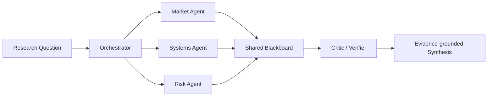

# MultiAgent-Researcher — Architecture

## Local design

The important design choice is bounded specialization rather than unlimited peer chat. 2026 coordination benchmarks show that more communication does not automatically produce better distributed reasoning.

## Evaluation
- required-topic evidence coverage
- message count
- communication density
- coverage/message efficiency
- provenance completeness
- failure under information silos
- single-agent baseline

# Production Scaling Architecture

## State separation
Stateless planner/agent APIs; stateful task state, shared workspace, evidence store, tool outputs, audit trails and model registry.

## Horizontal / vertical scaling
Agent workers scale horizontally by task/tool. Strong synthesizer/reviewer models scale vertically or on GPU pools.

## GPU serving
Separate model pools by role; use smaller specialist models where benchmarks support them and reserve stronger models for synthesis/verification.

## Batching / caching / quantization
Batch embeddings/retrieval, cache immutable research evidence by source hash, quantize specialist SLMs after quality regression.

## Queues
Durable workflow queue with task/agent/message IDs, deadlines, cancellation and retry semantics.

## Databases / vector / object storage
PostgreSQL for workflow state and permissions; vector/search indexes for evidence; object storage for source artifacts and reports.

## Ingestion
Source fetch → provenance check → content normalization → chunk/index → policy classification → publish to agent-accessible evidence store.

## Concurrency / load balancing
Per-task agent fan-out is bounded. Role-aware schedulers enforce message/tool budgets and prevent unbounded recursive delegation.

## Autoscaling
Queue depth, active tasks, tool latency, model GPU utilization and p95 task completion.

## HA / fault tolerance
Durable checkpoints, idempotent tool calls, agent-level retry, partial-result synthesis and explicit abstention if critical evidence roles fail.

## Distributed processing
Parallel role research is natural fan-out/fan-in. Global blackboard writes require optimistic concurrency/versioning.

## Model registry / versioning
Version each role model, prompt/policy, tool schema, evidence index, critic, synthesis policy and benchmark suite.

## CI/CD
Unit tests → coordination benchmark → tool-permission tests → provenance/grounding tests → cost/latency gates → shadow → canary.

## Telemetry
Trace each message/tool call. Measure communication density, token/message overhead, evidence coverage, conflicts, retries, task success and cost.

## IAM / secrets
Role-scoped tool credentials, least privilege, secret manager, source ACL propagation and immutable audit logs.

## Multi-tenancy
Tenant-isolated workspaces, evidence indexes, caches, traces and role permissions.

## Cost / performance
Treat messages and model calls as a budget. Add agents only when they improve coverage/quality enough to justify coordination overhead.

## Backup / DR
Back up workflow state, provenance, evidence manifests, policies and final reports. Canonical source data follows separate retention rules.

## Rollout / rollback
Shadow new orchestration graphs, compare quality and coordination overhead, canary by research task class, rollback via workflow-policy version.

## Cloud / on-prem / hybrid
On-prem for sensitive research corpora; cloud for elastic model/tool workers; hybrid for local evidence with centrally governed orchestration.

## ADRs
1. Multi-agent collaboration must beat a single-agent baseline.
2. Communication is budgeted and measured.
3. Evidence provenance survives every handoff.
4. Role permissions are explicit.
5. Critic/verifier is separate from evidence-gathering roles.
