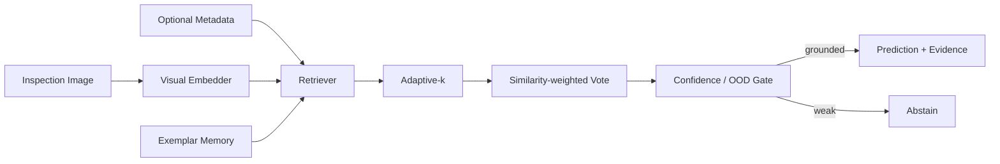

# VisionRAG-Local — Architecture

## Local design

The default embedder uses color moments, edge magnitude histograms and quadrant contrast, allowing the full RAG mechanics to run offline. A production encoder is replaceable.

## Rationale

Retrieval improves visual decisions when known labeled exemplars are valuable context. Unlike ordinary nearest-neighbor classification, the system exposes evidence, adapts retrieval depth, fuses metadata and supports explicit abstention.

Recent multimodal retrieval benchmarks show reasoning-intensive visual retrieval remains difficult, while visual exemplar-memory work such as SAR-RAG demonstrates retrieval can improve downstream recognition. Current adaptive retrieval work also argues against fixed-k retrieval for every query.

## Evaluation

- retrieval Recall@K
- accuracy on grounded predictions
- coverage / abstention rate
- class-specific precision/recall
- confidence calibration
- OOD false-accept rate
- latency and vector-memory footprint
- evidence-label agreement
- failure slices by illumination/machine/domain

# Production Scaling Architecture

## State separation
Stateless: API, embedder gateway, retrieval/fusion policy.
Stateful: object store, exemplar metadata DB, vector index, model/index registry, evaluation corpus.

## Horizontal/vertical scaling
Query APIs scale horizontally. GPU embedder services scale separately. Vector shards partition by tenant/product/domain. Vertical GPU scaling is reserved for larger vision encoders.

## GPU serving
Serve SigLIP/CLIP/DINOv2-like encoders through Triton/vLLM-compatible vision services where supported. Batch image embeddings within latency SLOs.

## Batching/caching/quantization
Precompute exemplar embeddings. Batch ingestion embeddings. Cache query embeddings by immutable image hash. Quantize encoders only after retrieval and OOD regression tests.

## Queues
Async ingestion pipeline: upload → validation → malware/image decode → metadata → embedding → quality checks → vector publish.

## Databases/vector/object storage
Object storage holds canonical images; PostgreSQL stores exemplar labels, provenance and ACLs; Qdrant/FAISS/Milvus/pgvector stores embeddings; registry stores model/index lineage.

## Ingestion
Every exemplar receives immutable content hash, label provenance, reviewer identity, model version and index version. Quarantine label-conflicted or low-quality exemplars.

## Concurrency/load balancing
Rate-limit image uploads and query embedding. Use GPU-aware routing. Retrieve only within tenant/product ACL filters.

## Autoscaling
Signals: embedder queue, GPU utilization, vector QPS/p95, ingestion backlog, cache hit rate.

## HA/fault tolerance
Replicated APIs/indexes, durable ingestion queues, idempotent embedding jobs and fallback to metadata/previous stable index if current index is unavailable.

## Distributed processing
Large corpora shard embedding by asset ID. Re-index in background, publish with aliases, and avoid partial live indexes.

## Model registry/versioning
Version encoder, preprocessing, embedding dimension, normalization, distance metric, adaptive-k policy, threshold calibration and exemplar snapshot together.

## CI/CD
Unit tests → retrieval benchmark → classification/abstention benchmark → illumination/OOD stress suite → latency/VRAM gate → shadow index → canary → alias promotion.

## Telemetry
Trace image decode → embed → retrieve → vote → gate. Monitor Recall@K, evidence agreement, abstention, OOD accepts, class drift, p95 latency, GPU utilization and index freshness.

## IAM/secrets
OIDC/workload identity, signed object access, encrypted stores, least privilege and immutable label/index audit logs.

## Multi-tenancy
Tenant-scoped vector namespaces, object prefixes, caches and label policies. Dedicated indexes/GPU pools for regulated tenants where needed.

## Cost/performance
Precompute corpus embeddings; invoke expensive rerankers/VLM comparison only for ambiguous neighborhoods. Track quality gain per retrieved exemplar and per GPU-ms.

## Backup/DR
Back up canonical images, labels, provenance and index manifests. Vector indexes are rebuildable from canonical objects + encoder version.

## Rollout/rollback
Build new embeddings/indexes side-by-side, shadow queries, compare retrieval/abstention metrics and switch aliases atomically. Rollback restores prior index+encoder bundle.

## Cloud/on-prem/hybrid
On-prem for proprietary manufacturing/medical imagery; cloud for elastic embedding; hybrid for plant/edge image capture with centrally managed encoder/index policies.

## ADRs
1. Retrieval evidence is returned with every grounded decision.
2. Fixed-k retrieval is avoided; neighborhood agreement controls evidence depth.
3. OOD/ambiguity yields abstention rather than forced classification.
4. Exemplar labels and provenance are governed artifacts.
5. Encoder and vector index are versioned as one compatibility unit.
