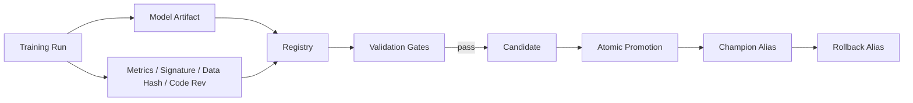

# MLOps-ModelRegistry — Architecture

## Local design

## Local implementation

SQLite stores metadata and aliases. A local object-store directory holds immutable model artifacts. Registration computes SHA-256, assigns monotonically increasing versions and stores:
- signature
- metrics
- tags
- training-data hash
- code revision
- run ID
- artifact checksum

Promotion is separated from registration. A model must pass policy gates and artifact integrity checks. Existing champion signatures must remain compatible before replacement.

## Why this mirrors current MLOps practice

Current MLflow Model Registry documentation treats the registry as a centralized lifecycle system with versioning, lineage, aliases and metadata. Model aliases such as `champion` are mutable pointers to immutable versions, allowing deployment to be decoupled from numeric versions.

The project implements those concepts locally so the lifecycle is testable without a running MLflow service.

## Evaluation / operational checks

Registry correctness:
- immutable version IDs
- artifact checksum verification
- signature compatibility
- promotion-gate behavior
- alias atomicity
- rollback correctness
- audit completeness

Model-quality checks remain task-specific and are policy inputs, not registry hardcoding.

# Production Scaling Architecture

## State separation
Stateless: registry API, promotion policy evaluator, deployment resolver.
Stateful: SQL metadata backend, object store, audit/event stream, model/evaluation lineage.

## Horizontal/vertical scaling
Scale registry APIs horizontally behind a load balancer. SQL and object storage provide durable state. Heavy artifact validation/scanning runs on worker pools.

## GPU serving
The registry does not require GPUs. Serving systems resolve a registry alias to a model URI and then deploy to CPU/GPU serving pools independently.

## Batching/caching/quantization
Cache alias resolution with short TTL and version-aware invalidation. Quantization is registered as a distinct model/version or artifact flavor with its own signature/benchmark metadata.

## Queues
Async events: model.registered → scan.requested → validation.requested → approved/rejected → promotion.requested → deployment.updated.

## Databases/vector/object storage
PostgreSQL/MySQL for registry metadata; S3/MinIO/GCS/Azure Blob for model artifacts; event bus for lifecycle events. Vector DB is not required for the registry itself.

## Ingestion
Training pipeline emits immutable artifact, model signature, metrics, parameters, dataset snapshot/hash, code/container revision and dependency manifest. Registry rejects missing mandatory lineage.

## Concurrency/load balancing
Use optimistic locking/version checks for alias promotion. Only one promotion transaction may update a model alias at a time. API replicas remain stateless.

## Autoscaling
Signals: registry QPS, artifact-validation queue, model-scan latency and promotion backlog. Registry traffic is usually modest compared with inference traffic.

## HA/fault tolerance
Highly available SQL, versioned object storage, replicated registry APIs and durable event queues. Registry outage should not stop existing inference because serving resolves/cache aliases beforehand.

## Distributed processing
Artifact malware/vulnerability scans, reproducibility checks and benchmark suites can shard by model version. Promotion waits for required gates.

## Model registry/versioning
Version:
- model artifact
- preprocessing/tokenizer
- signature
- dataset snapshot/hash
- code revision
- dependency/container image
- evaluation suite
- quantization/runtime
- approval metadata

MLflow-compatible production deployment can use registered model versions plus aliases/tags.

## CI/CD
Training CI → artifact/logging → registry registration → schema/integrity checks → offline benchmark → security scan → approval → candidate alias → shadow/canary → champion alias.

## Telemetry
Audit every registration, tag update, validation result, alias move and rollback. Track promotion lead time, failed gates, checksum errors, rollback count and unreferenced artifacts.

## IAM/secrets
OIDC/workload identity, least-privilege artifact access, signed promotion roles, KMS encryption, secrets manager and separation of trainer vs approver vs deployer duties.

## Multi-tenancy
Namespace models by tenant/team/environment. Enforce ACLs on metadata and object prefixes. Regulated teams may require dedicated registry/storage backends.

## Cost/performance
Keep large artifacts in object storage, not the SQL registry. Deduplicate by content hash where allowed. Retain only policy-required historical artifacts while keeping metadata/audit lineage.

## Backup/DR
Point-in-time SQL backups plus versioned/replicated object storage. Periodically test restoring champion aliases and verifying checksums against recovered artifacts.

## Rollout/rollback
Deployments consume aliases (`champion`, `candidate`) rather than fixed versions. Canary a candidate, then atomically reassign champion. Rollback reassigns the alias to the previous known-good version.

## Cloud/on-prem/hybrid
On-prem MLflow/MinIO/PostgreSQL for sovereign environments; managed cloud registries/object stores for elastic operations; hybrid supports on-prem training with centrally governed metadata when policy allows.

## ADRs
1. Model artifacts are immutable; aliases are mutable.
2. Registration and promotion are separate lifecycle steps.
3. Integrity, signature and lineage are mandatory promotion inputs.
4. Serving resolves aliases, not hard-coded version numbers.
5. Registry outage must not break already-running inference.
