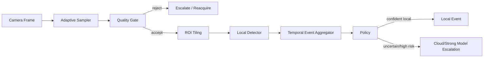

# EdgeVision-Analytics — Architecture

## Local design

## Rationale

Edge inspection systems are constrained by compute, memory, thermal envelope and network bandwidth. The main architecture decision is therefore **not to run the most expensive inference path on every frame**.

The local pipeline uses:
- frame stride;
- image quality filtering;
- fixed ROI tiling;
- inexpensive local anomaly detection;
- temporal event aggregation;
- escalation only for uncertain local decisions.

## Trade-offs

Higher frame skipping improves throughput but can miss short-lived defects. Smaller tiles improve localization but increase compute. Quantization improves footprint/latency but can reduce accuracy, so all deployment formats require regression tests.

## Deployment profile

Production adapters can replace the simple detector with:
- ONNX Runtime;
- OpenVINO Runtime;
- TensorRT;
- TensorRT-LLM/VLM where relevant.

For Intel edge hardware, OpenVINO/NNCF supports post-training quantization and low-precision transformations. On the user's GTX 1650 Ti, ONNX Runtime CUDA or a small TensorRT model is a practical option.

# Production Scaling Architecture

## State separation
Stateless: inference workers, quality checks, policy.
Stateful: edge event buffer, device registry, model manifest, calibration profile, telemetry spool.

## Horizontal/vertical scaling
Within a site, scale by camera/device. Central services scale horizontally across device fleets. Vertical scaling is limited by edge hardware, so model compression is preferred over larger machines.

## GPU serving
GPU-capable gateways may host one shared detector serving multiple camera streams with micro-batching. Low-power nodes run CPU/NPU paths.

## Batching/caching/quantization
Micro-batch adjacent frames only when latency SLO permits. Cache immutable model engines. INT8 PTQ is preferred for detector models after calibration; FP16 may be better on older NVIDIA GPUs when INT8 acceleration is limited.

## Queues
Each device has bounded in-memory/event queues. Upload queues persist only events/keyframes, not continuous full-rate video unless policy requires it.

## Databases/vector/object storage
PostgreSQL: device/model/deployment metadata.
Object storage: event clips/keyframes.
Time-series/metrics store: FPS, latency, temperatures, confidence, queue depth.
Vector store optional for visual incident retrieval.

## Ingestion
Camera → decoder → quality gate → sampling → local model → event aggregation → local sink / cloud escalation.

## Concurrency
One stream cannot monopolize inference. Use per-camera queues, max in-flight frames and backpressure. Drop stale frames rather than processing old video indefinitely.

## Load balancing
Gateway-level schedulers route frames to healthy inference workers based on accelerator availability and queue depth.

## Autoscaling
Central cloud escalation pools scale on event queue depth. Edge nodes normally do not autoscale; they switch policy profiles instead.

## HA/fault tolerance
Store-and-forward buffering handles WAN loss. If GPU inference fails, degrade to CPU low-rate inspection or fail-safe manual inspection policy.

## Distributed processing
Fleet analytics processes events asynchronously by device/site. Do not centralize raw video when event metadata is sufficient.

## Model registry/versioning
Version model checksum, runtime, precision, image size, thresholds, calibration dataset, preprocessing and postprocessing.

## CI/CD
Unit tests → synthetic detector benchmark → representative-camera validation → quantized-vs-FP benchmark → latency/thermal soak → shadow → canary devices → fleet rollout.

## Telemetry
Per-device FPS, p50/p95 latency, dropped frames, quality rejects, event rate, escalation rate, confidence, GPU memory, temperature and model version.

## IAM/secrets
Device identities, mutual TLS, signed model manifests, least-privilege upload tokens and encrypted local secrets.

## Multi-tenancy
Plant/site namespaces separate event storage, device control and model policies. Regulated plants may have dedicated on-prem control planes.

## Cost/performance
Optimize cost per inspected frame and false-negative risk, not FPS alone. Key levers: stride, resolution, tile count, precision and escalation rate.

## Backup/DR
Back up device registry, model manifests, calibration profiles and event metadata. Raw continuous video follows retention policy.

## Rollout/rollback
Use device cohorts. New engines run in shadow, then canary, then progressive fleet rollout. Rollback is a signed model-manifest pointer change.

## Cloud/on-prem/hybrid
On-prem edge inference is default for latency/privacy. Cloud handles fleet analytics and expensive escalation. Fully cloud inference is reserved for bandwidth-rich, non-latency-critical scenarios.

## ADRs
1. Sampling and quality gates precede expensive inference.
2. Edge events, not raw video, are the primary uplink artifact.
3. Quantization requires task-specific regression testing.
4. Uncertain decisions may escalate; confident routine decisions stay local.
5. Model + runtime + precision are versioned as one deployment artifact.
