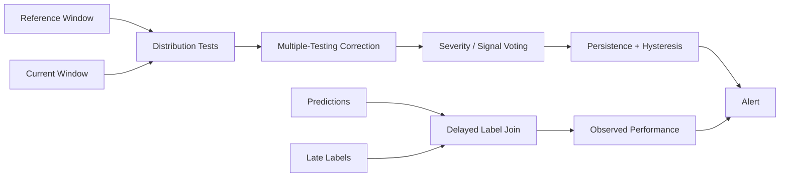

# DriftWatch-ML — Architecture

## Local design

## Why false alarms are first-class

Continuous monitoring repeats statistical tests over time and across many features. Even modest per-test false-positive rates can create operational alarm fatigue. The monitor therefore includes:
- minimum sample-size gates;
- corrected significance thresholds;
- multi-signal voting;
- persistent alerting;
- explicit recovery windows.

## Detector mix

KS catches general one-dimensional distribution changes. PSI is operationally common but sensitive to binning/sample size. Mean-shift effect size provides interpretable magnitude. Linear MMD proxy provides a kernel-style distribution-distance signal. No single detector is trusted independently.

## Delayed labels

Observed performance may arrive hours/days/weeks later. Predictions and labels are joined by event ID when labels arrive; unsupervised feature/prediction drift fills the visibility gap but is never equated with true performance degradation.

# Production Scaling Architecture

## State separation
Stateless: drift calculation workers, alert policy.
Stateful: reference windows, rolling sketches, model metadata, alert state, delayed-label joins, incidents.

## Horizontal/vertical scaling
Partition monitoring by model/version/tenant. Drift workers scale horizontally. Vertical scaling is rarely required except for high-dimensional embedding drift.

## GPU serving
Not needed for scalar/tabular drift. GPU may be used for embedding extractors on image/text models; statistical monitoring remains CPU.

## Batching/caching
Use fixed-duration or fixed-count windows. Maintain streaming sketches/histograms rather than retaining all raw events when possible. Cache reference summaries by model version.

## Queues
Prediction telemetry enters Kafka/NATS/PubSub-style topics. Separate delayed-label topics join asynchronously.

## Databases/vector/object storage
PostgreSQL for monitor configs/incidents. Time-series DB for metrics. Object storage for investigation snapshots. Feature/embedding stores only where needed. Vector storage is optional for embedding-drift forensics.

## Ingestion
Prediction events include model version, features or approved summaries, prediction/confidence, entity/tenant ID and event timestamp. Sensitive raw features can be summarized before export.

## Concurrency
Each model-version window is independently processed. Use deterministic window IDs and idempotent alert evaluation.

## Load balancing
Workers consume partitioned monitoring streams. Partition keys include tenant and model version to preserve ordering where needed.

## Autoscaling
Scale on telemetry lag, partition backlog and processing latency. Alerting services remain lightweight.

## HA/fault tolerance
Durable telemetry streams, checkpointed window state and idempotent incident creation. Monitoring outage must not silently reset alert persistence state.

## Distributed processing
Large fleets use streaming aggregators (Flink/Spark/Kafka Streams) to compute summaries, followed by centralized policy evaluation.

## Model registry/versioning
Every baseline is tied to model version, feature schema, reference period, detector configuration and thresholds.

## CI/CD
Unit tests → stable-data false-positive benchmark → controlled-shift sensitivity benchmark → batch-size sweep → shadow monitoring → alert review → production enablement.

## Telemetry
Monitor monitoring itself: events ingested, lag, detector runtime, false-alert rate, alert volume, recovery time, missing labels and stale references.

## IAM/secrets
Use workload identity and least privilege. Monitoring data may contain sensitive features, so raw payload access must be restricted and audited.

## Multi-tenancy
References, thresholds, windows and incidents are tenant-scoped. Never compare one tenant's production distribution against another unless explicitly intended.

## Cost/performance
Prefer compact summaries and selective high-dimensional monitoring. Monitor business-critical features first. Alert on material impact, not every statistically detectable shift.

## Backup/DR
Back up detector configs, model/reference lineage, alert state and incident history. Raw telemetry follows normal retention policies.

## Rollout/rollback
New thresholds run in shadow before paging operators. Rollback restores the previous monitor-policy version without altering model serving.

## Cloud/on-prem/hybrid
Monitoring can run next to sensitive data on-prem while aggregate health metrics flow centrally. Cloud is useful for multi-region fleet aggregation and incident tooling.

## ADRs
1. Continuous-monitoring false-alarm rate is a release metric.
2. Multiple detectors vote; no single statistic pages operators.
3. Minimum batch size is enforced.
4. Persistent alerts are preferred over one-window spikes.
5. Unsupervised drift is not treated as observed performance loss.
6. Reference windows are versioned with the model.
