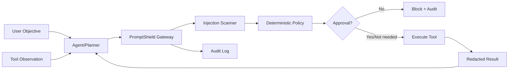

# PromptShield-Local Architecture

## Local design

The model is not the security boundary. Every side-effecting tool call crosses a deterministic gateway.

## Rationale and trade-offs
Pattern scanning alone is bypassable, so it is only one signal. The stronger controls are default deny, least privilege, argument allowlists, path scopes, call budgets and explicit approval for high-risk tools. This can reduce agent autonomy and add approval latency, but it makes authorization auditable and independent of model compliance.

## ADRs
1. Treat all retrieved/tool content as untrusted.
2. Enforce policy after planning but before execution.
3. Default deny unknown tools and arguments.
4. Human approval is mandatory for configured high-risk effects.
5. Audit records redact secrets.
6. Security policy is versioned separately from prompts/models.

# Production Scaling Architecture

## State separation
Stateless: policy evaluators, scanners, redactors. Stateful: session budgets, approvals, policy versions, audit trails, incident state.

## Horizontal/vertical scaling
Policy gateways scale horizontally behind a load balancer. Vertical scaling is rarely needed unless semantic classifiers are added.

## GPU serving
Core enforcement is CPU-only. Optional local classifiers can run on shared GPU pools; authorization must fail closed if classifiers are unavailable where policy requires them.

## Batching/caching/quantization
Cache signed policy bundles and tool schemas. Batch optional classifier inference only within latency SLOs. Quantize auxiliary SLM classifiers to INT8/4-bit; deterministic controls remain unchanged.

## Queues
Use durable queues for audit export, approval workflows and asynchronous incident enrichment. Never queue an unauthorized side effect for later execution.

## Databases/vector/object storage
PostgreSQL for tenants/policies/approvals; Redis for short-lived session budgets; object storage for immutable audit archives; vector storage optional for attack-signature retrieval.

## Ingestion
Normalize user objective, tool metadata, arguments, provenance and untrusted observations into one authorization envelope.

## Concurrency
Use idempotency keys per proposed action. Session counters use atomic updates. Approval tokens are single-use and bound to exact action hashes.

## Load balancing
Route by tenant and region; keep policy bundles replicated locally. Health checks distinguish policy-engine health from optional classifier health.

## Autoscaling
Scale on authorization QPS and queue depth. Reserve headroom because security checks sit on the critical path.

## HA/fault tolerance
Multiple gateway replicas, replicated policy store, durable audits. Default behavior for unavailable mandatory controls is fail closed.

## Distributed processing
Central policy management publishes signed bundles to regional/edge enforcement points. Audits stream asynchronously to SIEM/data lake.

## Model registry/versioning
Version model, prompt, tool schema, security policy and attack-suite revision independently; attach all versions to every audit decision.

## CI/CD
Unit tests -> policy regression -> adversarial corpus -> benign-utility suite -> shadow mode -> canary tenant -> progressive rollout.

## Telemetry
Track authorization latency, block rate, false-positive rate, approval rate, tool distribution, injection signatures, policy version and attack-suite coverage.

## IAM/secrets
Workload identity, mTLS, least-privilege service accounts, secret manager, short-lived credentials and signed tool manifests.

## Multi-tenancy
Tenant-scoped tool allowlists, data boundaries, approval groups, audit keys and quotas. Never reuse one tenant's retrieved context in another tenant.

## Cost/performance
Deterministic checks are cheap. Run semantic classifiers only on ambiguous/high-risk cases. Measure security cost per authorized action and approval burden.

## Backup/DR
Back up policy history, approval records and audit metadata. Cross-region replicas must preserve policy version ordering.

## Rollout/rollback
Security rules first run in report-only mode, then canary enforcement. Rollback restores the previous signed policy bundle without changing the agent model.

## Cloud/on-prem/hybrid
On-prem enforcement is preferred when tools touch sensitive internal systems. Cloud control planes simplify fleet management. Hybrid deployments keep enforcement close to tools while centralizing signed policy distribution and telemetry.
