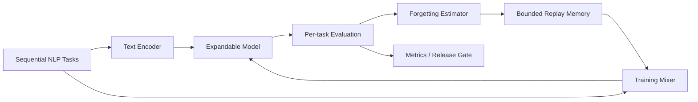

# ContinualLearn-NLP Architecture

## Local design

The local core separates continual-learning orchestration from the model backend, making replay, evaluation and governance testable on CPU; a LoRA/QLoRA SLM can replace the lightweight learner.

## Rationale / trade-offs / ADRs
1. Bounded replay gives predictable memory/privacy surface at the cost of imperfect retention.
2. Forgotten tasks receive replay priority instead of uniform sampling.
3. Stability regularization penalizes movement from the previous anchor; too much blocks plasticity.
4. Model backend is replaceable; control-plane correctness does not require a large model download.
5. Sequential evaluation is mandatory because current-task accuracy hides catastrophic forgetting.
6. Raw replay data requires governance; sensitive deployments may need approved exemplars or replay-free methods.

# Production Scaling Architecture

## State separation
Stateless: preprocessing, inference, evaluation workers. Stateful: task registry, replay catalog, model lineage, training runs, metrics, release state.

## Horizontal/vertical scaling
Inference scales horizontally. Continual-training jobs scale by task/domain; larger SLM backends scale vertically to GPU nodes.

## GPU serving
Serve quantized SLMs through vLLM/TGI/ONNX/OpenVINO depending hardware. Training uses PEFT adapters rather than full-model updates.

## Batching/caching/quantization
Dynamic inference batching; cache tokenizer and immutable base weights. 4-bit/8-bit base quantization with FP16/BF16 adapters where supported. Cache evaluation embeddings only when version-safe.

## Queues
Task/data arrival events, training requests, evaluation jobs and release approvals flow through durable queues. Idempotency keys prevent duplicate adaptation.

## Databases/vector/object storage
PostgreSQL: task/model/run metadata. Object storage: datasets, adapters, reports. Vector DB optional for exemplar selection and semantic replay. Metrics store for forgetting/drift.

## Ingestion
Schema validation, PII classification, deduplication, task assignment, quality checks and immutable dataset versioning precede training.

## Concurrency
One model lineage has serialized writes; independent domains may train concurrently. Evaluation runs are immutable and parallel.

## Load balancing
Inference routes by model/version/tenant. Training scheduler routes jobs by VRAM and adapter requirements.

## Autoscaling
Inference scales on QPS/latency. Training workers scale on queued adaptation jobs. Replay/evaluation workers scale on backlog.

## HA/fault tolerance
Replicated serving, durable task queues, checkpointed adapters, retry-safe evaluation and immutable model artifacts. Failed adaptation never replaces the active version.

## Distributed processing
Large replay selection and evaluation use distributed data processing; adapter training can use DDP/FSDP only when model size warrants it.

## Model registry/versioning
Version base model, tokenizer, adapter, task sequence, replay snapshot, dataset hash, training config and evaluation suite as one lineage graph.

## CI/CD
Unit tests -> data contract -> sequential regression suite -> forgetting threshold -> safety/eval suite -> shadow -> canary -> progressive rollout.

## Telemetry
Current-task accuracy, historical-task accuracy, average forgetting, backward transfer, replay composition, drift, latency, GPU memory, training cost and version.

## IAM/secrets
Workload identity, least privilege, secret manager, signed artifacts and audited access to replay samples.

## Multi-tenancy
Tenant-scoped adapters, replay stores, evaluation suites and encryption keys. Shared base weights are immutable; tenant data never enters another tenant's replay.

## Cost/performance
Prefer PEFT and bounded replay. Trigger adaptation only when drift/business impact exceeds thresholds. Track cost per retained capability and cost per successful adaptation.

## Backup/DR
Back up model registry, adapters, replay metadata, approved exemplars and evaluation history. Raw sensitive replay follows retention policy.

## Rollout/rollback
Every adaptation is a candidate version. Shadow evaluation and canary traffic precede promotion. Rollback repoints serving to the previous base+adapter lineage.

## Cloud/on-prem/hybrid
On-prem suits sensitive replay and constrained data residency. Cloud suits elastic training/serving. Hybrid keeps private replay/training near data while centralizing registry and aggregate telemetry.
